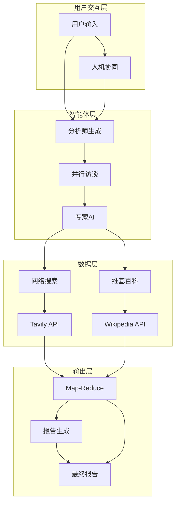

# LangGraph 研究助手系统

> 基于 LangGraph 的多智能体研究自动化系统，专为 AI Agent 初学者设计

## 📖 文档导航

| 文档 | 描述 | 适用人群 |
|------|------|----------|
| [快速入门指南](quick-start-guide.md) | 5分钟快速上手，基础概念介绍 | AI Agent 初学者 |
| [完整说明文档](research-assistant-documentation.md) | 详细的技术文档，包含架构图和流程图 | 开发者、技术专家 |

## 🎯 项目简介

LangGraph 研究助手是一个基于多智能体架构的自动化研究系统，通过 AI 分析师团队进行深度研究并生成高质量报告。该系统展示了如何使用 LangGraph 构建复杂的 AI 工作流，是学习多智能体系统的绝佳案例。

### ✨ 核心特性

- 🤖 **多智能体协作**: 多个专业分析师并行工作
- 👥 **人机协同**: 支持人类反馈和调整
- 🔍 **智能检索**: 集成网络搜索和维基百科
- 📊 **Map-Reduce模式**: 高效聚合多源信息
- 📝 **自动报告生成**: 生成结构化的研究报告
- 🔄 **状态管理**: 完整的执行状态追踪

## 🏗️ 系统架构

### 整体架构


## 🚀 快速开始

### 环境准备
```bash
# 安装依赖
pip install langgraph==0.6.7
pip install langchain_openai==0.3.32
pip install langchain_community==0.3.29
pip install tavily-python==0.7.12
pip install wikipedia==1.4.0

# 设置环境变量
export OPENAI_API_KEY="your-openai-key"
export TAVILY_API_KEY="your-tavily-key"
```

### 基础使用
```python
from langchain_openai import ChatOpenAI

# 初始化模型
llm = ChatOpenAI(model="gpt-4o", temperature=0)

# 运行研究流程
result = graph.invoke({
    "topic": "AI Agent的未来发展",
    "max_analysts": 3
})
```

## 📚 学习价值

### 对初学者的价值
1. **多智能体系统设计**: 学习如何设计和实现多智能体协作
2. **人机协同机制**: 理解如何实现有效的人机协同
3. **复杂工作流编排**: 掌握 LangGraph 的核心概念
4. **状态管理和持久化**: 学习复杂状态的管理方法
5. **外部服务集成**: 了解如何集成各种外部服务

### 技术栈学习
- **LangGraph**: 多智能体工作流编排
- **LangChain**: 大语言模型应用开发
- **Pydantic**: 数据验证和序列化
- **OpenAI GPT-4o**: 大语言模型应用
- **Tavily Search**: 高质量网络搜索
- **Wikipedia**: 知识检索

## 🎯 应用场景

### 学术研究
- 文献综述和趋势分析
- 跨领域研究整合
- 学术观点对比分析

### 商业分析
- 市场研究和竞争分析
- 技术评估和投资决策
- 行业趋势跟踪

### 政策制定
- 政策影响分析
- 利益相关者研究
- 风险评估和预测

## 📁 项目结构

```
langchain-academy/
├── module-4/
│   ├── research-assistant.ipynb    # 主要代码文件
│   └── studio/                     # 部署相关文件
├── research-assistant-documentation.md  # 完整技术文档
├── quick-start-guide.md            # 快速入门指南
└── README.md                       # 项目说明（本文件）
```

## 🔧 配置说明

### 必需配置
- `OPENAI_API_KEY`: OpenAI API 密钥
- `TAVILY_API_KEY`: Tavily 搜索 API 密钥

### 可选配置
- `OPENAI_BASE_URL`: OpenAI API 代理地址
- `LANGSMITH_API_KEY`: LangSmith 追踪密钥
- `LANGSMITH_PROJECT`: LangSmith 项目名称

## 📖 使用指南

### 1. 基础使用
参考 [快速入门指南](quick-start-guide.md) 了解基本使用方法。

### 2. 高级配置
参考 [完整说明文档](research-assistant-documentation.md) 了解详细配置和自定义选项。

### 3. 最佳实践
- 选择具体明确的研究主题
- 合理配置分析师数量和角色
- 定期审查生成结果的质量
- 利用人机协同优化输出

## 🤝 贡献指南

欢迎贡献代码、文档或提出改进建议！

### 贡献方式
1. Fork 本项目
2. 创建特性分支
3. 提交更改
4. 发起 Pull Request

### 问题反馈
如果遇到问题，请：
1. 查看文档和常见问题
2. 检查环境配置
3. 查看 LangSmith 追踪日志
4. 提交 Issue 描述问题

## 📄 许可证

本项目基于 MIT 许可证开源。

## 🙏 致谢

- [LangChain](https://github.com/langchain-ai/langchain) - 大语言模型应用框架
- [LangGraph](https://github.com/langchain-ai/langgraph) - 多智能体工作流框架
- [OpenAI](https://openai.com/) - 大语言模型服务
- [Tavily](https://tavily.com/) - 高质量搜索 API

## 📞 联系方式

- 项目地址: [GitHub Repository]
- 文档地址: [Documentation]
- 问题反馈: [Issues]

---

**开始你的 AI Agent 学习之旅！** 🚀

> 这个项目是学习 LangGraph 和多智能体系统的绝佳起点。通过实际案例，你将掌握构建复杂 AI 工作流的核心技能。