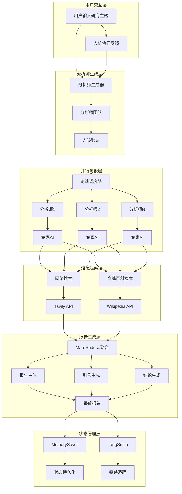
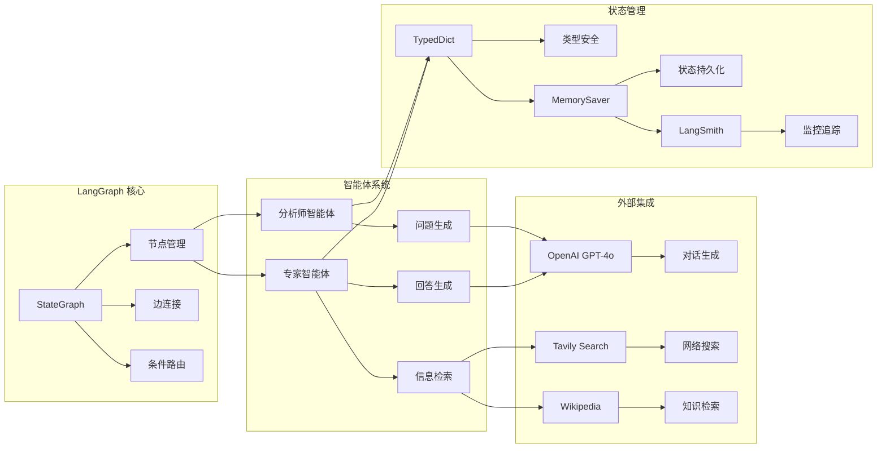
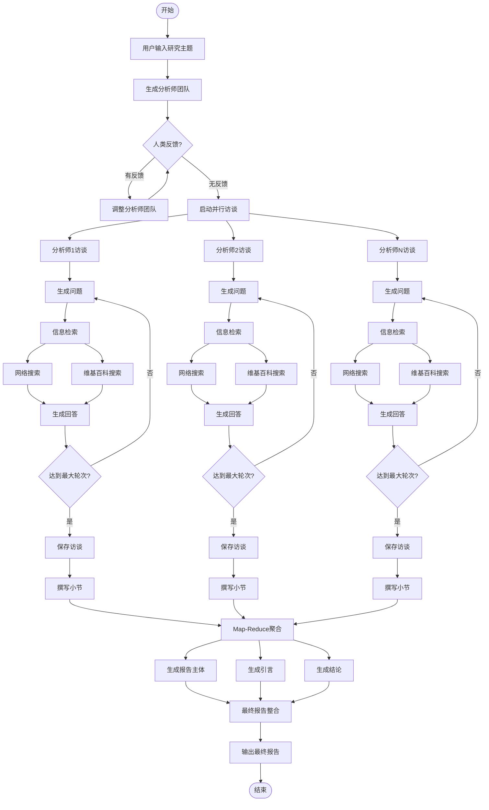

# LangGraph 研究助手系统说明文档

## 项目概述

LangGraph 研究助手是一个基于多智能体架构的自动化研究系统，旨在通过 AI 分析师团队进行深度研究并生成高质量报告。该系统结合了人机协同、并行处理和智能路由等先进技术，为 AI Agent 初学者提供了一个完整的多智能体系统学习案例。

## 系统架构

### 整体架构图



### 核心组件架构



## 技术栈

### 核心框架
- **LangGraph**: 多智能体工作流编排框架
- **LangChain**: 大语言模型应用开发框架
- **Pydantic**: 数据验证和序列化

### 大语言模型
- **OpenAI GPT-4o**: 主要对话和内容生成模型
- **结构化输出**: 确保数据格式一致性

### 外部服务
- **Tavily Search**: 高质量网络搜索API
- **Wikipedia**: 维基百科知识检索
- **LangSmith**: 链路追踪和监控平台

### 开发工具
- **Jupyter Notebook**: 交互式开发环境
- **Python 3.8+**: 主要编程语言
- **MemorySaver**: 状态持久化存储

## 系统功能

### 1. 分析师团队生成
- **功能**: 根据研究主题自动生成多个专业分析师角色
- **特点**: 支持人机协同调整，确保分析师团队的专业性和多样性
- **输出**: 包含姓名、隶属机构、角色和描述的分析师列表

### 2. 并行访谈系统
- **功能**: 多个分析师同时与专家AI进行深度访谈
- **特点**: 支持多轮对话，确保信息获取的深度和广度
- **技术**: 使用Send API实现真正的并行执行

### 3. 智能信息检索
- **网络搜索**: 通过Tavily API获取最新网络信息
- **维基百科**: 获取权威知识库信息
- **并行检索**: 同时从多个来源获取信息

### 4. 报告生成系统
- **Map-Reduce模式**: 将多个访谈结果聚合为统一报告
- **结构化输出**: 生成包含引言、主体和结论的完整报告
- **引用管理**: 自动处理来源引用和格式

## 工作流程

### 完整流程图



### 详细执行步骤

#### 阶段1: 分析师生成
1. **输入处理**: 接收研究主题和分析师数量限制
2. **AI生成**: 使用GPT-4o生成分析师角色
3. **人机协同**: 允许人类审查和调整分析师团队
4. **迭代优化**: 根据反馈重新生成分析师

#### 阶段2: 并行访谈
1. **访谈启动**: 为每个分析师创建独立的访谈线程
2. **问题生成**: 分析师根据人设生成专业问题
3. **信息检索**: 并行执行网络搜索和维基百科搜索
4. **回答生成**: 专家AI基于检索信息回答问题
5. **对话循环**: 重复问答直到达到最大轮次或访谈结束

#### 阶段3: 报告生成
1. **小节撰写**: 将每个访谈转换为结构化报告小节
2. **Map-Reduce聚合**: 将多个小节整合为统一报告
3. **引言生成**: 创建报告的整体概览
4. **结论生成**: 总结主要发现和洞察
5. **最终整合**: 组合所有部分形成完整报告

## 应用场景

### 1. 学术研究
- **文献综述**: 自动收集和分析相关研究文献
- **趋势分析**: 跟踪特定领域的最新发展
- **比较研究**: 对比不同观点和方法

### 2. 商业分析
- **市场研究**: 分析行业趋势和竞争格局
- **技术评估**: 评估新技术的影响和潜力
- **投资决策**: 为投资决策提供数据支持

### 3. 政策制定
- **政策研究**: 分析政策影响和效果
- **利益相关者分析**: 识别和分析相关利益方
- **风险评估**: 评估政策实施的风险

### 4. 技术开发
- **技术调研**: 了解技术发展现状和趋势
- **架构设计**: 为系统设计提供参考
- **最佳实践**: 收集和整理行业最佳实践

## 操作指南

### 环境准备

#### 1. 安装依赖
```bash
pip install langgraph==0.6.7
pip install langchain_openai==0.3.32
pip install langchain_community==0.3.29
pip install langchain_core==0.3.75
pip install tavily-python==0.7.12
pip install wikipedia==1.4.0
```

#### 2. 环境变量配置
```python
import os
import getpass

def _set_env(var: str):
    if not os.environ.get(var):
        os.environ[var] = getpass.getpass(f"{var}: ")

# 必需的环境变量
_set_env("OPENAI_API_KEY")      # OpenAI API密钥
_set_env("OPENAI_BASE_URL")     # OpenAI API代理地址
_set_env("TAVILY_API_KEY")      # Tavily搜索API密钥
_set_env("LANGSMITH_API_KEY")   # LangSmith追踪密钥（可选）

# 启用追踪
os.environ["LANGSMITH_TRACING"] = "true"
os.environ["LANGSMITH_PROJECT"] = "langchain-academy"
```

### 基本使用

#### 1. 初始化系统
```python
from langchain_openai import ChatOpenAI

# 初始化大语言模型
llm = ChatOpenAI(model="gpt-4o", temperature=0)
```

#### 2. 运行研究流程
```python
# 设置研究参数
max_analysts = 3
topic = "采用LangGraph作为AI Agent框架的好处"
thread = {"configurable": {"thread_id": "1"}}

# 运行完整流程
for event in graph.stream({
    "topic": topic,
    "max_analysts": max_analysts
}, thread, stream_mode="values"):
    
    # 处理分析师生成结果
    analysts = event.get('analysts', '')
    if analysts:
        for analyst in analysts:
            print(f"Name: {analyst.name}")
            print(f"Affiliation: {analyst.affiliation}")
            print(f"Role: {analyst.role}")
            print(f"Description: {analyst.description}")
            print("-" * 50)
```

#### 3. 人机协同调整
```python
# 提供人类反馈
graph.update_state(thread, {
    "human_analyst_feedback": "添加一个AI原生初创公司的CEO"
}, as_node="human_feedback")

# 继续执行
for event in graph.stream(None, thread, stream_mode="values"):
    # 处理更新后的结果
    pass
```

### 高级配置

#### 1. 自定义分析师生成
```python
# 修改分析师生成指令
analyst_instructions = """
你需要创建一组 AI 分析师人设。请严格遵循以下指引：

1. 先审阅研究主题：{topic}
2. 查看编辑反馈：{human_analyst_feedback}
3. 基于上述文档识别最值得关注的主题
4. 选出前 {max_analysts} 个主题
5. 为每个主题分配一位分析师
"""
```

#### 2. 调整访谈参数
```python
# 修改访谈轮次
interview_config = {
    "analyst": analyst,
    "messages": [HumanMessage(content=f"So you said you were writing an article on {topic}?")],
    "max_num_turns": 3  # 增加访谈轮次
}
```

#### 3. 自定义报告格式
```python
# 修改报告写作指令
report_writer_instructions = """
你是一名技术写作者，正在为如下主题撰写报告：{topic}

报告格式要求：
1. 使用 Markdown 格式
2. 报告不要有任何前言
3. 不使用任何小标题
4. 报告以一个标题开头：## Insights
5. 报告中不要提及任何分析师的名字
6. 保留备忘录中的引用标注
7. 汇总最终来源列表
"""
```

### 最佳实践

#### 1. 主题选择
- **具体性**: 选择具体的研究主题，避免过于宽泛
- **时效性**: 考虑主题的时效性和相关性
- **可研究性**: 确保主题有足够的信息来源

#### 2. 分析师配置
- **数量控制**: 建议3-5个分析师，平衡深度和效率
- **角色多样性**: 确保分析师来自不同背景和视角
- **专业匹配**: 分析师角色应与研究主题相关

#### 3. 访谈优化
- **轮次设置**: 根据主题复杂度调整访谈轮次
- **问题质量**: 确保问题具有针对性和深度
- **信息验证**: 对关键信息进行交叉验证

#### 4. 报告质量
- **结构清晰**: 确保报告结构逻辑清晰
- **引用准确**: 保持引用信息的准确性
- **内容平衡**: 平衡不同分析师的观点

### 故障排除

#### 1. 常见问题
- **API限制**: 检查API密钥和配额限制
- **网络连接**: 确保网络连接稳定
- **依赖版本**: 检查依赖包版本兼容性

#### 2. 调试技巧
- **启用追踪**: 使用LangSmith进行详细追踪
- **日志记录**: 添加详细的日志记录
- **状态检查**: 定期检查系统状态

#### 3. 性能优化
- **并行处理**: 充分利用并行处理能力
- **缓存机制**: 实现适当的缓存机制
- **资源管理**: 合理管理系统资源

## 技术特点

### 1. 多智能体协作
- **角色分工**: 每个分析师专注于特定领域
- **并行执行**: 多个智能体同时工作
- **信息整合**: 智能整合不同视角的信息

### 2. 人机协同
- **人类监督**: 人类可以审查和调整AI决策
- **反馈循环**: 支持基于反馈的迭代优化
- **质量控制**: 确保输出质量符合预期

### 3. 状态管理
- **持久化存储**: 使用MemorySaver保存状态
- **类型安全**: 使用TypedDict确保类型安全
- **状态追踪**: 完整的执行状态追踪

### 4. 可扩展性
- **模块化设计**: 各组件独立可替换
- **插件架构**: 支持添加新的数据源
- **配置灵活**: 支持多种配置选项

## 学习价值

### 1. LangGraph核心概念
- **StateGraph**: 状态图的基本使用
- **节点和边**: 工作流的基本构建块
- **条件路由**: 基于状态的条件执行
- **子图**: 复杂工作流的模块化

### 2. 多智能体系统
- **智能体设计**: 如何设计有效的智能体
- **协作机制**: 智能体之间的协作方式
- **信息流**: 信息在智能体间的传递
- **冲突解决**: 处理不同智能体的观点冲突

### 3. 人机协同
- **交互设计**: 设计有效的人机交互
- **反馈机制**: 如何收集和利用人类反馈
- **质量控制**: 确保AI输出的质量
- **用户体验**: 优化用户使用体验

### 4. 工程实践
- **代码组织**: 如何组织复杂的代码结构
- **错误处理**: 健壮的错误处理机制
- **测试策略**: 如何测试复杂的AI系统
- **部署考虑**: 生产环境的部署考虑

## 总结

LangGraph 研究助手系统是一个完整的多智能体应用案例，展示了如何使用 LangGraph 构建复杂的 AI 工作流。通过这个系统，初学者可以学习到：

1. **多智能体系统设计**: 如何设计和实现多智能体协作
2. **人机协同机制**: 如何实现有效的人机协同
3. **复杂工作流编排**: 如何使用 LangGraph 编排复杂的工作流
4. **状态管理和持久化**: 如何管理复杂的状态信息
5. **外部服务集成**: 如何集成各种外部服务
6. **报告生成系统**: 如何构建智能的报告生成系统

这个系统不仅是一个实用的研究工具，更是一个优秀的学习案例，为 AI Agent 初学者提供了全面的技术学习和实践机会。
