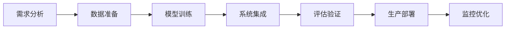
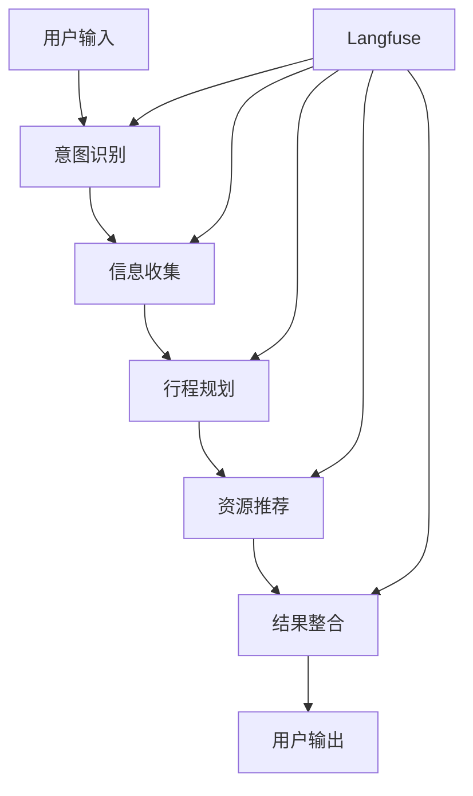
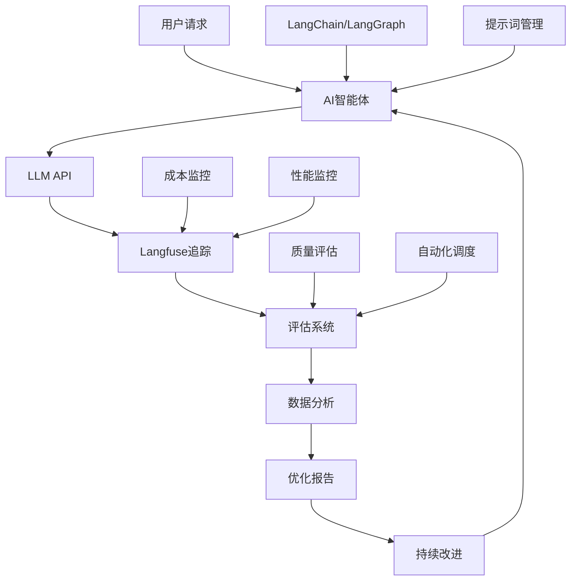

# 大模型评估体系与Langfuse实战指南

> 面向大模型技术初学者的全面评估实战教程

## 目录

1. [第一章：为什么说评估是AI产品落地的"最后一公里"？](#第一章为什么说评估是ai产品落地的最后一公里)
2. [第二章：大模型评估方法论：选择最适合你的评估策略](#第二章大模型评估方法论选择最适合你的评估策略)
3. [第三章：主流评估工具深度解析](#第三章主流评估工具深度解析)
4. [第四章：项目实战（上）- 搭建可观测的评估基础设施](#第四章项目实战上-搭建可观测的评估基础设施)
5. [第五章：项目实战（中）- 自动化评估与数据驱动分析](#第五章项目实战中-自动化评估与数据驱动分析)
6. [第六章：项目实战（下）- 编写评估报告与优化建议](#第六章项目实战下-编写评估报告与优化建议)
7. [第七章：知识点回顾与实战作业](#第七章知识点回顾与实战作业)

---

## 第一章：为什么说评估是AI产品落地的"最后一公里"？

### 1.1 AI产品开发的完整生命周期

在AI产品开发中，我们通常经历以下阶段：



**为什么评估是"最后一公里"？**

1. **质量保障的最后防线**：评估是确保AI系统满足业务需求的最后检查点
2. **风险控制的关键环节**：避免有问题的模型直接面向用户
3. **性能优化的数据依据**：为后续迭代提供科学的改进方向
4. **商业价值的验证手段**：证明AI系统能够带来实际的业务价值

### 1.2 缺乏评估的常见问题

#### 💥 真实案例分析

**案例1：聊天机器人的幻觉问题**
```python
# 未经评估的聊天机器人可能出现的问题
user_question = "北京到上海的高铁票价是多少？"
model_response = "北京到上海的高铁票价是350元，全程约4小时。"
# 实际：票价可能不准确，没有考虑座位类型、时间等因素
```

**案例2：推荐系统的偏差问题**
- 推荐算法可能存在性别、年龄、地域偏见
- 没有评估就无法发现这些潜在的公平性问题

**案例3：内容生成的质量问题**
- 生成的内容可能包含有害信息
- 事实性错误
- 语言表达不当

### 1.3 评估在AI项目中的价值

#### 🎯 商业价值

1. **降低风险成本**
   - 避免错误决策造成的损失
   - 减少用户投诉和负面反馈
   - 保护品牌声誉

2. **提升用户体验**
   - 确保AI系统的可靠性
   - 提高响应的准确性
   - 增强用户信任度

3. **优化资源配置**
   - 识别性能瓶颈
   - 指导硬件资源分配
   - 优化成本效益比

#### 🛠️ 技术价值

1. **模型性能监控**
   - 实时跟踪模型表现
   - 及时发现性能下降
   - 支持模型版本管理

2. **数据驱动优化**
   - 基于评估结果优化提示词
   - 调整模型参数
   - 改进训练数据

3. **系统可观测性**
   - 全面了解系统运行状态
   - 支持问题诊断和调试
   - 提供优化方向指导

### 1.4 本章小结

评估不是AI项目的可选项，而是必需品。它是确保AI系统质量、控制风险、实现商业价值的关键环节。在接下来的章节中，我们将深入学习如何构建完善的评估体系。

---

## 第二章：大模型评估方法论：选择最适合你的评估策略

### 2.1 大模型评估的挑战

与传统软件测试不同，大模型评估面临独特的挑战：

#### 🎲 不确定性
- 相同输入可能产生不同输出
- 模型行为难以完全预测
- 评估标准相对主观

#### 🌍 复杂性
- 多模态输入输出
- 上下文依赖性强
- 任务类型多样化

#### 📏 评估标准
- 缺乏统一的评估基准
- 质量标准因应用而异
- 人工评估成本高昂

### 2.2 四种主流评估方法详解

#### 方法一：单元式自动化测试

**核心理念**：像测试传统软件一样，为大模型编写自动化测试用例。

**适用场景**：
- API接口测试
- 基础功能验证
- 回归测试
- 性能基准测试

**实现示例**：
```python
import pytest
from langchain_openai import ChatOpenAI

class TestLLMBasicFunctions:
    
    def setup_method(self):
        """测试前准备"""
        self.llm = ChatOpenAI(model="gpt-4o", temperature=0)
    
    def test_basic_qa(self):
        """测试基础问答功能"""
        question = "1+1等于多少？"
        response = self.llm.invoke(question)
        
        # 断言：响应应该包含正确答案
        assert "2" in response.content
        assert len(response.content) > 0
    
    def test_response_format(self):
        """测试响应格式"""
        prompt = "请用JSON格式回答：北京的天气如何？"
        response = self.llm.invoke(prompt)
        
        # 验证响应格式
        import json
        try:
            json.loads(response.content)
            assert True
        except:
            assert False, "响应不是有效的JSON格式"
    
    def test_response_time(self):
        """测试响应时间"""
        import time
        
        start_time = time.time()
        response = self.llm.invoke("Hello")
        end_time = time.time()
        
        # 断言：响应时间应该在合理范围内
        assert (end_time - start_time) < 30  # 30秒内响应
```

**优势**：
✅ 自动化程度高  
✅ 可重复执行  
✅ 适合CI/CD集成  
✅ 成本低廉  

**劣势**：
❌ 只能测试有明确预期的场景  
❌ 难以评估创造性和主观性任务  
❌ 测试用例编写复杂  

#### 方法二：人机交互评估

**核心理念**：通过人工专家评估模型输出的质量。

**评估维度**：
- **准确性（Accuracy）**：回答是否正确
- **相关性（Relevance）**：回答是否与问题相关
- **完整性（Completeness）**：回答是否全面
- **清晰性（Clarity）**：表达是否清楚易懂
- **有用性（Helpfulness）**：回答是否对用户有帮助

**评估流程**：
```python
# 人工评估表格示例
evaluation_criteria = {
    "accuracy": {
        "description": "回答的事实准确性",
        "scale": "1-5分",
        "guidelines": {
            5: "完全准确，无任何事实错误",
            4: "基本准确，有轻微不准确",
            3: "部分准确，有一些错误",
            2: "大部分不准确，错误较多", 
            1: "完全不准确，严重错误"
        }
    },
    "relevance": {
        "description": "回答与问题的相关性",
        "scale": "1-5分",
        "guidelines": {
            5: "完全相关，直接回答问题",
            4: "基本相关，略有偏题",
            3: "部分相关，有一定偏差",
            2: "相关性较低，偏题明显",
            1: "完全不相关，答非所问"
        }
    }
}
```

**实施建议**：

1. **建立评估标准**
   - 制定详细的评分指南
   - 提供评估示例
   - 确保评估者理解一致

2. **多人评估机制**
   - 至少2-3人独立评估
   - 计算评估者间一致性
   - 讨论分歧并达成共识

3. **批量评估流程**
   - 随机抽样评估样本
   - 定期进行评估
   - 记录评估结果和反馈

**优势**：
✅ 能评估主观性强的任务  
✅ 发现自动化测试难以发现的问题  
✅ 提供定性反馈  
✅ 贴近真实用户体验  

**劣势**：
❌ 成本高昂  
❌ 主观性强，可能不一致  
❌ 难以大规模实施  
❌ 时间周期长  

#### 方法三：LLM-as-a-Judge 综合评估

**核心理念**：使用另一个LLM作为"评判官"来评估目标模型的输出。

**工作原理**：
```python
def llm_as_judge_evaluator(question, answer, criteria):
    """
    使用LLM作为评判官的评估函数
    """
    evaluation_prompt = f"""
    请作为一个专业的AI评估专家，评估以下AI助手的回答质量。

    **用户问题**：
    {question}

    **AI助手回答**：
    {answer}

    **评估标准**：
    {criteria}

    **评估要求**：
    1. 根据评估标准对回答进行打分（1-5分）
    2. 简述评分理由
    3. 指出可以改进的地方

    **输出格式**：
    {{
        "score": 4,
        "reasoning": "回答准确且相关，但可以更加详细...",
        "improvements": "建议增加具体例子和更详细的解释"
    }}
    """
    
    judge_model = ChatOpenAI(model="gpt-4o", temperature=0)
    result = judge_model.invoke(evaluation_prompt)
    
    return result.content
```

**评估维度示例**：
```python
# 多维度评估模板
evaluation_dimensions = {
    "factual_accuracy": {
        "description": "事实准确性",
        "weight": 0.3,
        "prompt_template": "评估回答中事实信息的准确性"
    },
    "relevance": {
        "description": "相关性", 
        "weight": 0.25,
        "prompt_template": "评估回答与问题的相关程度"
    },
    "completeness": {
        "description": "完整性",
        "weight": 0.25, 
        "prompt_template": "评估回答是否全面回答了问题"
    },
    "clarity": {
        "description": "清晰性",
        "weight": 0.2,
        "prompt_template": "评估回答的表达是否清楚易懂"
    }
}
```

**优势**：
✅ 可大规模自动化执行  
✅ 成本相对较低  
✅ 可以评估复杂的主观任务  
✅ 提供详细的评估理由  

**劣势**：
❌ 依赖评判模型的质量  
❌ 可能存在评估偏见  
❌ 对提示词设计要求高  

#### 方法四：混合评估框架

**核心理念**：结合多种评估方法，构建全面的评估体系。

**框架设计**：
```python
class HybridEvaluationFramework:
    """混合评估框架"""
    
    def __init__(self):
        self.automated_tests = []
        self.human_evaluators = []
        self.llm_judges = []
        
    def add_automated_test(self, test_func):
        """添加自动化测试"""
        self.automated_tests.append(test_func)
        
    def add_human_evaluator(self, evaluator):
        """添加人工评估者"""
        self.human_evaluators.append(evaluator)
        
    def add_llm_judge(self, judge_config):
        """添加LLM评判官"""
        self.llm_judges.append(judge_config)
        
    def comprehensive_evaluate(self, test_cases):
        """综合评估"""
        results = {
            "automated": {},
            "human": {},
            "llm_judge": {}
        }
        
        # 1. 执行自动化测试
        for test in self.automated_tests:
            results["automated"][test.__name__] = test(test_cases)
            
        # 2. 人工评估（抽样）
        sample_cases = random.sample(test_cases, min(50, len(test_cases)))
        for evaluator in self.human_evaluators:
            results["human"][evaluator.name] = evaluator.evaluate(sample_cases)
            
        # 3. LLM评判
        for judge in self.llm_judges:
            results["llm_judge"][judge["name"]] = judge["func"](test_cases)
            
        return self.aggregate_results(results)
        
    def aggregate_results(self, results):
        """聚合评估结果"""
        # 实现结果聚合逻辑
        pass
```

**实施策略**：

1. **基础层：自动化测试**
   - 覆盖基本功能
   - 性能基准测试
   - 回归测试

2. **核心层：LLM评估**
   - 主要质量指标
   - 大规模评估
   - 持续监控

3. **顶层：人工验证**
   - 关键场景验证
   - 质量抽检
   - 边界情况分析

### 2.3 如何选择合适的评估策略

#### 🎯 基于应用场景选择

| 应用类型 | 推荐策略 | 重点关注 |
|---------|---------|---------|
| API服务 | 自动化测试 + LLM评估 | 响应时间、准确性 |
| 聊天机器人 | 人工评估 + LLM评估 | 用户体验、对话连贯性 |
| 内容生成 | LLM评估 + 人工抽检 | 创造性、事实准确性 |
| 代码生成 | 自动化测试 + 执行验证 | 代码正确性、安全性 |

#### 💰 基于资源预算选择

- **有限预算**：优先选择自动化测试 + LLM评估
- **充足预算**：实施混合评估框架
- **高质量要求**：必须包含人工评估环节

#### ⏰ 基于时间要求选择

- **快速迭代**：主要依靠自动化测试
- **产品上线前**：全面的混合评估
- **日常监控**：LLM评估 + 定期人工抽检

### 2.4 本章小结

选择合适的评估策略需要考虑多个因素：

1. **明确评估目标**：是为了发现bug、提升质量，还是持续监控？
2. **了解资源约束**：时间、人力、预算的限制
3. **匹配应用特点**：不同类型的AI应用需要不同的评估重点
4. **构建渐进式评估体系**：从简单到复杂，逐步完善

在下一章中，我们将深入了解主流的评估工具，学习如何选择和使用合适的技术平台。

---

## 第三章：主流评估工具深度解析

### 3.1 评估工具生态概览

在大模型评估领域，目前主要有以下几类工具：

#### 🔧 开源评估平台
- **Langfuse**：专注于LLM应用的可观测性
- **Phoenix**：Arize AI开源的ML监控平台
- **MLflow**：通用的机器学习生命周期管理

#### 🏢 商业评估平台
- **LangSmith**：LangChain官方的商业平台
- **Weights & Biases**：综合性ML实验管理平台
- **Neptune**：实验跟踪和模型监控

#### 🛠️ 集成式解决方案
- **Hugging Face Evaluate**：集成多种评估指标
- **OpenAI Evals**：OpenAI官方评估框架
- **DeepEval**：专门针对LLM的评估库

### 3.2 Langfuse深度解析

#### 核心功能特点

**1. 全链路追踪（Full Stack Tracing）**
```python
# Langfuse追踪示例
from langfuse import Langfuse
from langfuse.langchain import CallbackHandler

langfuse = Langfuse()
langfuse_handler = CallbackHandler()

# 自动捕获LangChain执行过程
chain = create_qa_chain()
result = chain.invoke(
    {"question": "什么是机器学习？"},
    config={"callbacks": [langfuse_handler]}
)
```

**功能亮点**：
- 🎯 **零侵入集成**：通过回调函数自动收集数据
- 📊 **完整链路可视化**：从输入到输出的完整执行流程
- 💰 **成本追踪**：自动计算Token使用量和API成本
- ⏱️ **性能监控**：延迟、吞吐量等关键指标

**2. 提示词管理（Prompt Management）**
```python
# 提示词版本管理
prompt_template = langfuse.get_prompt("travel-agent-prompt", version=2)
formatted_prompt = prompt_template.compile(
    destination="北京",
    days=3,
    budget=5000
)
```

**管理功能**：
- 📝 **版本控制**：提示词的版本管理和回滚
- 🧪 **A/B测试**：不同提示词版本的效果对比
- 🔄 **动态更新**：线上提示词的热更新
- 📈 **效果分析**：不同版本的性能指标对比

**3. 数据集评估（Dataset Evaluation）**
```python
# 创建评估数据集
dataset = langfuse.create_dataset(
    name="travel-qa-benchmark",
    description="旅行智能体问答基准测试集"
)

# 添加测试用例
for item in test_cases:
    langfuse.create_dataset_item(
        dataset_name="travel-qa-benchmark",
        input=item["question"],
        expected_output=item["expected_answer"]
    )
```

**4. 自动化评估（Automated Scoring）**
```python
# 配置LLM-as-a-Judge评估器
evaluator_config = {
    "name": "helpfulness-evaluator",
    "model": "gpt-4o",
    "prompt": """
    评估以下AI助手回答的有用性程度（1-5分）：
    
    用户问题：{input}
    AI回答：{output}
    
    评分标准：
    5分：非常有用，完全解决了用户问题
    4分：比较有用，基本解决了用户问题
    3分：一般有用，部分解决了用户问题
    2分：较少有用，基本没有解决用户问题
    1分：完全无用，完全没有解决用户问题
    
    请给出分数和简短理由。
    """
}
```

#### 架构设计理念

**1. 开放性（Openness）**
- 开源核心代码
- 支持自托管部署
- API优先的设计理念

**2. 集成友好（Integration-Friendly）**
- 支持主流LLM框架
- 最小化代码修改
- 丰富的SDK支持

**3. 可扩展性（Scalability）**
- 云原生架构
- 水平扩展支持
- 高并发场景优化

### 3.3 LangSmith深度解析

#### 核心优势

**1. 官方生态集成**
```python
# LangSmith与LangChain的深度集成
import os
from langsmith import Client
from langchain_openai import ChatOpenAI

os.environ["LANGCHAIN_TRACING_V2"] = "true"
os.environ["LANGCHAIN_PROJECT"] = "travel-agent-evaluation"

# 自动启用追踪
llm = ChatOpenAI()
result = llm.invoke("推荐北京三日游路线")
```

**2. 企业级功能**
- 🔐 **SSO集成**：企业级身份认证
- 👥 **团队协作**：多人协作评估
- 🏢 **私有部署**：支持企业内部部署
- 📊 **高级分析**：深度数据分析功能

**3. 实验管理**
```python
# 实验对比功能
from langsmith import evaluate

def travel_agent_evaluator(run, example):
    # 自定义评估逻辑
    score = calculate_travel_plan_quality(
        run.outputs["plan"], 
        example.outputs["expected_plan"]
    )
    return {"score": score}

# 运行评估实验
evaluate(
    lambda inputs: travel_agent.invoke(inputs),
    data="travel-benchmark-dataset",
    evaluators=[travel_agent_evaluator]
)
```

#### 定位与特色

**目标用户**：
- 使用LangChain生态的企业用户
- 需要企业级支持的团队
- 对安全性要求较高的组织

**核心特色**：
- 与LangChain无缝集成
- 企业级功能完善
- 官方技术支持

### 3.4 Phoenix深度解析

#### 技术特点

**1. ML监控专业性**
```python
# Phoenix监控配置
import phoenix as px
from phoenix.trace import using_project

# 启动Phoenix服务
px.launch_app()

# 项目级别的追踪
with using_project("travel-agent"):
    # AI应用运行代码
    pass
```

**2. 多框架支持**
- LangChain
- LlamaIndex  
- OpenAI直接调用
- Anthropic Claude
- 自定义框架

**3. 可观测性功能**
- 📈 **实时监控**：系统性能实时监控
- 🔍 **根因分析**：问题诊断和分析
- 📊 **数据漂移检测**：输入输出分布变化
- 🎯 **异常检测**：自动识别异常行为

### 3.5 工具选择决策框架

#### 选择矩阵

| 评估维度 | Langfuse | LangSmith | Phoenix | MLflow |
|---------|----------|-----------|---------|--------|
| **开源程度** | ⭐⭐⭐⭐⭐ | ⭐⭐ | ⭐⭐⭐⭐⭐ | ⭐⭐⭐⭐⭐ |
| **LLM专业性** | ⭐⭐⭐⭐⭐ | ⭐⭐⭐⭐⭐ | ⭐⭐⭐⭐ | ⭐⭐⭐ |
| **企业功能** | ⭐⭐⭐⭐ | ⭐⭐⭐⭐⭐ | ⭐⭐⭐ | ⭐⭐⭐⭐ |
| **易用性** | ⭐⭐⭐⭐⭐ | ⭐⭐⭐⭐ | ⭐⭐⭐ | ⭐⭐⭐ |
| **社区活跃度** | ⭐⭐⭐⭐ | ⭐⭐⭐ | ⭐⭐⭐ | ⭐⭐⭐⭐⭐ |
| **成本** | 免费/付费 | 付费 | 免费 | 免费/付费 |

#### 选择建议

**选择Langfuse的场景**：
- 🎯 专注于LLM应用开发
- 💰 预算有限的初创团队
- 🔧 需要自托管的组织
- 📊 重视可观测性的团队

**选择LangSmith的场景**：
- 🏢 大型企业用户
- 🔗 深度使用LangChain生态
- 🛡️ 对安全性要求极高
- 💼 需要官方技术支持

**选择Phoenix的场景**：
- 🔬 ML工程师主导的团队
- 🎯 需要通用ML监控能力
- 🆓 完全开源的需求
- 🔍 重视根因分析能力

### 3.6 本章小结

选择合适的评估工具需要考虑以下因素：

1. **技术栈匹配度**：与现有技术栈的兼容性
2. **功能需求匹配**：是否满足核心评估需求
3. **预算考量**：开源vs商业的成本权衡
4. **团队技能**：团队的技术能力和学习成本
5. **长期规划**：工具的发展前景和生态

在接下来的实战章节中，我们将以Langfuse为例，详细讲解如何搭建完整的评估体系。

---

## 第四章：项目实战（上）- 搭建可观测的评估基础设施

### 4.1 实战项目介绍：AI旅行智能体

#### 项目背景
我们将构建一个AI旅行智能体，它能够：
- 🗺️ 根据用户需求推荐旅行目的地
- 📅 制定详细的行程规划
- 🏨 推荐住宿和餐饮
- 💰 预算规划和成本估算
- 🎯 个性化定制建议

#### 系统架构


### 4.2 环境准备与Langfuse集成

#### 步骤1：安装依赖包

```bash
# 创建虚拟环境
python -m venv travel-agent-env
source travel-agent-env/bin/activate  # Linux/Mac
# travel-agent-env\Scripts\activate  # Windows

# 安装必要的包
pip install langfuse==3.3.0
pip install langchain==0.3.27  
pip install langchain-openai==0.3.31
pip install langchain-community==0.3.27
pip install langgraph
```

#### 步骤2：Langfuse账号设置

```python
import os

# 🔑 Langfuse配置
# 从项目设置页面获取：https://cloud.langfuse.com
os.environ["LANGFUSE_PUBLIC_KEY"] = "pk-lf-your-public-key"
os.environ["LANGFUSE_SECRET_KEY"] = "sk-lf-your-secret-key" 
os.environ["LANGFUSE_HOST"] = "https://cloud.langfuse.com"

# 🤖 OpenAI配置
os.environ["OPENAI_API_KEY"] = "sk-your-openai-key"
```

#### 步骤3：验证连接

```python
from langfuse import get_client

# 初始化客户端并验证连接
langfuse = get_client()

if langfuse.auth_check():
    print("✅ Langfuse客户端连接成功！")
    print("🚀 可以开始构建可观测的AI应用了")
else:
    print("❌ 连接失败，请检查配置")
    print("🔧 检查项：API密钥、网络连接、服务器状态")
```

### 4.3 构建AI旅行智能体

#### 核心智能体类

```python
from typing import Dict, List, Any, Optional
from langchain_openai import ChatOpenAI
from langchain_core.messages import HumanMessage, SystemMessage
from langfuse.langchain import CallbackHandler
import json

class TravelAgent:
    """AI旅行智能体"""
    
    def __init__(self, model_name: str = "gpt-4o"):
        """
        初始化旅行智能体
        
        Args:
            model_name: 使用的LLM模型名称
        """
        self.llm = ChatOpenAI(
            model=model_name,
            temperature=0.7,  # 适度的创造性
            max_tokens=2000   # 确保足够详细的回答
        )
        
        # 初始化Langfuse追踪
        self.langfuse_handler = CallbackHandler()
        
        # 系统提示词
        self.system_prompt = """
你是一个专业的AI旅行顾问，具有丰富的全球旅行经验和本地化知识。

**你的核心能力**：
- 🗺️ 目的地推荐：基于用户偏好推荐合适的旅行目的地
- 📅 行程规划：制定详细、可行的旅行计划
- 🏨 资源推荐：推荐住宿、餐饮、交通、景点
- 💰 预算规划：提供现实的成本估算
- 🎯 个性化服务：根据用户特殊需求定制方案

**回答原则**：
1. 🎯 **准确性优先**：提供准确、最新的信息
2. 🌟 **实用性导向**：给出可执行的具体建议
3. 💝 **个性化服务**：充分考虑用户的特殊需求
4. 📊 **结构化输出**：使用清晰的格式组织信息
5. 💰 **预算意识**：始终考虑成本效益

**输出格式**：
请使用JSON格式回答，包含以下字段：
- destination: 推荐的目的地
- itinerary: 详细行程安排
- accommodations: 住宿推荐
- dining: 餐饮推荐  
- budget_estimate: 预算估算
- special_tips: 特殊提示

现在，请根据用户的需求提供专业的旅行建议。
"""

    def plan_trip(self, user_request: str) -> Dict[str, Any]:
        """
        制定旅行计划
        
        Args:
            user_request: 用户的旅行需求描述
            
        Returns:
            旅行计划的详细信息
        """
        
        # 构建消息
        messages = [
            SystemMessage(content=self.system_prompt),
            HumanMessage(content=f"用户需求：{user_request}")
        ]
        
        # 使用Langfuse追踪调用LLM
        try:
            response = self.llm.invoke(
                messages,
                config={"callbacks": [self.langfuse_handler]}
            )
            
            # 解析响应
            plan = self._parse_response(response.content)
            
            # 添加元数据
            plan["model_used"] = self.llm.model_name
            plan["user_request"] = user_request
            plan["response_length"] = len(response.content)
            
            return plan
            
        except Exception as e:
            print(f"❌ 制定旅行计划时出错：{str(e)}")
            return {"error": str(e)}
    
    def _parse_response(self, response_content: str) -> Dict[str, Any]:
        """解析LLM的JSON响应"""
        try:
            # 尝试解析JSON
            return json.loads(response_content)
        except json.JSONDecodeError:
            # 如果不是有效JSON，返回原始内容
            return {
                "raw_response": response_content,
                "parsing_error": "响应不是有效的JSON格式"
            }
```

#### 增强版智能体（多Agent协作）

```python
from langgraph.graph import StateGraph, START, END
from typing_extensions import TypedDict

class TravelPlanState(TypedDict):
    """旅行规划状态"""
    user_request: str
    destination_analysis: Optional[Dict]
    itinerary_plan: Optional[Dict] 
    budget_analysis: Optional[Dict]
    final_recommendation: Optional[Dict]
    messages: List[Dict[str, Any]]

class MultiAgentTravelPlanner:
    """多智能体旅行规划系统"""
    
    def __init__(self):
        self.llm = ChatOpenAI(model="gpt-4o", temperature=0.7)
        self.langfuse_handler = CallbackHandler()
        
        # 构建状态图
        self.graph = self._build_graph()
    
    def _build_graph(self) -> StateGraph:
        """构建多智能体协作图"""
        
        # 创建状态图
        workflow = StateGraph(TravelPlanState)
        
        # 添加节点
        workflow.add_node("destination_agent", self.destination_analysis)
        workflow.add_node("itinerary_agent", self.itinerary_planning) 
        workflow.add_node("budget_agent", self.budget_planning)
        workflow.add_node("integration_agent", self.result_integration)
        
        # 定义执行流程
        workflow.add_edge(START, "destination_agent")
        workflow.add_edge("destination_agent", "itinerary_agent")
        workflow.add_edge("itinerary_agent", "budget_agent")
        workflow.add_edge("budget_agent", "integration_agent")
        workflow.add_edge("integration_agent", END)
        
        return workflow.compile()
    
    def destination_analysis(self, state: TravelPlanState) -> TravelPlanState:
        """目的地分析智能体"""
        
        prompt = f"""
        作为目的地分析专家，请分析以下用户需求并推荐最适合的目的地：
        
        用户需求：{state["user_request"]}
        
        请分析：
        1. 用户的旅行偏好（文化、自然、美食等）
        2. 推荐2-3个合适的目的地
        3. 每个目的地的特色和优势
        4. 最佳旅行时间建议
        
        以JSON格式返回分析结果。
        """
        
        response = self.llm.invoke(
            [HumanMessage(content=prompt)],
            config={"callbacks": [self.langfuse_handler]}
        )
        
        try:
            analysis = json.loads(response.content)
        except:
            analysis = {"raw_response": response.content}
            
        state["destination_analysis"] = analysis
        state["messages"].append({
            "agent": "destination_agent",
            "content": response.content
        })
        
        return state
    
    def itinerary_planning(self, state: TravelPlanState) -> TravelPlanState:
        """行程规划智能体"""
        
        destination_info = state.get("destination_analysis", {})
        
        prompt = f"""
        作为行程规划专家，基于目的地分析结果制定详细的旅行行程：
        
        原始需求：{state["user_request"]}
        目的地分析：{json.dumps(destination_info, ensure_ascii=False)}
        
        请制定：
        1. 详细的日程安排（逐日计划）
        2. 主要景点和活动推荐
        3. 交通安排建议
        4. 住宿区域推荐
        
        以JSON格式返回行程计划。
        """
        
        response = self.llm.invoke(
            [HumanMessage(content=prompt)],
            config={"callbacks": [self.langfuse_handler]}
        )
        
        try:
            itinerary = json.loads(response.content)
        except:
            itinerary = {"raw_response": response.content}
            
        state["itinerary_plan"] = itinerary
        state["messages"].append({
            "agent": "itinerary_agent", 
            "content": response.content
        })
        
        return state
    
    def budget_planning(self, state: TravelPlanState) -> TravelPlanState:
        """预算规划智能体"""
        
        itinerary = state.get("itinerary_plan", {})
        
        prompt = f"""
        作为预算规划专家，为制定的行程提供详细的成本估算：
        
        原始需求：{state["user_request"]}
        行程计划：{json.dumps(itinerary, ensure_ascii=False)}
        
        请估算：
        1. 交通费用（机票、当地交通）
        2. 住宿费用（不同等级选择）
        3. 餐饮费用（预估每日消费）
        4. 景点门票和活动费用
        5. 购物和其他费用
        6. 总预算区间（经济/舒适/豪华）
        
        以JSON格式返回预算分析。
        """
        
        response = self.llm.invoke(
            [HumanMessage(content=prompt)],
            config={"callbacks": [self.langfuse_handler]}
        )
        
        try:
            budget = json.loads(response.content)
        except:
            budget = {"raw_response": response.content}
            
        state["budget_analysis"] = budget
        state["messages"].append({
            "agent": "budget_agent",
            "content": response.content
        })
        
        return state
    
    def result_integration(self, state: TravelPlanState) -> TravelPlanState:
        """结果整合智能体"""
        
        prompt = f"""
        作为旅行顾问，整合所有分析结果，提供最终的旅行建议：
        
        原始需求：{state["user_request"]}
        目的地分析：{json.dumps(state.get("destination_analysis", {}), ensure_ascii=False)}
        行程计划：{json.dumps(state.get("itinerary_plan", {}), ensure_ascii=False)}
        预算分析：{json.dumps(state.get("budget_analysis", {}), ensure_ascii=False)}
        
        请整合为：
        1. 最终推荐的完整旅行方案
        2. 重点提示和注意事项
        3. 可选的替代方案
        4. 预订建议和时间安排
        
        以JSON格式返回最终建议。
        """
        
        response = self.llm.invoke(
            [HumanMessage(content=prompt)],
            config={"callbacks": [self.langfuse_handler]}
        )
        
        try:
            final_rec = json.loads(response.content)
        except:
            final_rec = {"raw_response": response.content}
            
        state["final_recommendation"] = final_rec
        state["messages"].append({
            "agent": "integration_agent",
            "content": response.content
        })
        
        return state
    
    def plan_trip(self, user_request: str) -> Dict[str, Any]:
        """执行完整的旅行规划流程"""
        
        initial_state = TravelPlanState(
            user_request=user_request,
            destination_analysis=None,
            itinerary_plan=None,
            budget_analysis=None, 
            final_recommendation=None,
            messages=[]
        )
        
        # 执行工作流
        result = self.graph.invoke(initial_state)
        
        return result
```

### 4.4 设置完整的追踪体系

#### 自定义追踪装饰器

```python
from functools import wraps
from langfuse import Langfuse
import time

def trace_travel_agent(trace_name: str = None):
    """
    旅行智能体追踪装饰器
    
    Args:
        trace_name: 追踪名称
    """
    def decorator(func):
        @wraps(func)
        def wrapper(*args, **kwargs):
            
            langfuse = Langfuse()
            
            # 确定追踪名称
            name = trace_name or f"travel-agent-{func.__name__}"
            
            # 开始追踪
            with langfuse.start_as_current_span(name=name) as span:
                
                # 记录输入
                span.update_trace(
                    input={
                        "function": func.__name__,
                        "args": args,
                        "kwargs": kwargs
                    }
                )
                
                # 执行函数
                start_time = time.time()
                try:
                    result = func(*args, **kwargs)
                    
                    # 记录成功结果
                    span.update_trace(
                        output=result,
                        metadata={
                            "execution_time": time.time() - start_time,
                            "status": "success"
                        }
                    )
                    
                    return result
                    
                except Exception as e:
                    # 记录错误
                    span.update_trace(
                        output={"error": str(e)},
                        metadata={
                            "execution_time": time.time() - start_time,
                            "status": "error",
                            "error_type": type(e).__name__
                        }
                    )
                    raise
                    
        return wrapper
    return decorator

# 使用示例
class TrackedTravelAgent(TravelAgent):
    """带追踪功能的旅行智能体"""
    
    @trace_travel_agent("travel-planning")
    def plan_trip(self, user_request: str) -> Dict[str, Any]:
        return super().plan_trip(user_request)
    
    @trace_travel_agent("destination-recommendation")
    def recommend_destinations(self, preferences: Dict[str, Any]) -> List[str]:
        """推荐目的地"""
        
        prompt = f"""
        基于用户偏好推荐旅行目的地：
        偏好：{json.dumps(preferences, ensure_ascii=False)}
        
        请推荐3-5个合适的目的地，并说明推荐理由。
        """
        
        response = self.llm.invoke(
            [HumanMessage(content=prompt)],
            config={"callbacks": [self.langfuse_handler]}
        )
        
        return response.content
```

### 4.5 数据收集配置

#### 配置数据收集策略

```python
class TravelAgentDataCollector:
    """旅行智能体数据收集器"""
    
    def __init__(self):
        self.langfuse = Langfuse()
    
    def setup_data_collection(self):
        """设置数据收集配置"""
        
        # 1. 配置用户会话追踪
        self.session_config = {
            "collect_user_feedback": True,
            "collect_session_metadata": True,
            "track_user_journey": True
        }
        
        # 2. 配置性能指标收集
        self.performance_config = {
            "track_latency": True,
            "track_token_usage": True,
            "track_cost": True,
            "track_error_rate": True
        }
        
        # 3. 配置质量指标收集
        self.quality_config = {
            "collect_output_quality": True,
            "track_user_satisfaction": True,
            "monitor_hallucinations": True
        }
    
    def log_user_interaction(self, session_id: str, user_input: str, 
                           agent_output: str, user_feedback: Dict = None):
        """记录用户交互"""
        
        with self.langfuse.start_as_current_span(
            name="user-interaction",
            session_id=session_id
        ) as span:
            
            span.update_trace(
                input=user_input,
                output=agent_output,
                metadata={
                    "session_id": session_id,
                    "timestamp": time.time(),
                    "user_feedback": user_feedback
                }
            )
            
            # 如果有用户反馈，记录为评分
            if user_feedback:
                span.score_trace(
                    name="user-satisfaction",
                    value=user_feedback.get("rating", 0),
                    comment=user_feedback.get("comment", "")
                )
    
    def log_performance_metrics(self, trace_id: str, metrics: Dict[str, Any]):
        """记录性能指标"""
        
        self.langfuse.create_score(
            trace_id=trace_id,
            name="performance-metrics",
            value=metrics.get("overall_score", 0),
            data_type="NUMERIC",
            comment=json.dumps(metrics)
        )
    
    def create_evaluation_dataset(self, name: str, test_cases: List[Dict]):
        """创建评估数据集"""
        
        # 创建数据集
        dataset = self.langfuse.create_dataset(
            name=name,
            description=f"旅行智能体评估数据集 - {name}",
            metadata={
                "created_at": time.time(),
                "test_case_count": len(test_cases),
                "dataset_type": "travel_agent_evaluation"
            }
        )
        
        # 添加测试用例
        for i, case in enumerate(test_cases):
            self.langfuse.create_dataset_item(
                dataset_name=name,
                input=case["input"],
                expected_output=case.get("expected_output"),
                metadata={
                    "case_id": i,
                    "category": case.get("category", "general"),
                    "difficulty": case.get("difficulty", "medium")
                }
            )
        
        print(f"✅ 创建数据集 '{name}'，包含 {len(test_cases)} 个测试用例")
        return dataset
```

### 4.6 本章实战演练

#### 完整的示例运行

```python
def main():
    """主函数：完整演示可观测的旅行智能体"""
    
    print("🚀 启动AI旅行智能体评估系统")
    
    # 1. 初始化组件
    agent = TrackedTravelAgent()
    collector = TravelAgentDataCollector()
    collector.setup_data_collection()
    
    # 2. 准备测试用例
    test_cases = [
        {
            "input": "我想去一个有古典文化的地方，预算1万元，时间5天",
            "category": "cultural_travel",
            "difficulty": "medium"
        },
        {
            "input": "推荐适合亲子游的海滨城市，预算不限，7天时间",
            "category": "family_travel", 
            "difficulty": "easy"
        },
        {
            "input": "我是摄影爱好者，想去拍摄自然风光，预算5000元，时间灵活",
            "category": "photography_travel",
            "difficulty": "hard"
        }
    ]
    
    # 3. 创建评估数据集
    dataset = collector.create_evaluation_dataset(
        name="travel-agent-benchmark-v1",
        test_cases=test_cases
    )
    
    # 4. 运行测试并收集数据
    session_id = f"test-session-{int(time.time())}"
    
    for i, case in enumerate(test_cases):
        print(f"\n📝 处理测试用例 {i+1}: {case['category']}")
        
        # 执行旅行规划
        result = agent.plan_trip(case["input"])
        
        # 模拟用户反馈
        simulated_feedback = {
            "rating": 4.2,  # 模拟评分
            "comment": "回答很详细，建议很实用"
        }
        
        # 记录交互数据
        collector.log_user_interaction(
            session_id=session_id,
            user_input=case["input"],
            agent_output=json.dumps(result, ensure_ascii=False),
            user_feedback=simulated_feedback
        )
        
        print(f"✅ 完成测试用例 {i+1}")
    
    print("\n🎉 所有测试用例执行完成！")
    print("📊 请访问 Langfuse 控制台查看详细的追踪数据")
    print("🔗 https://cloud.langfuse.com")

if __name__ == "__main__":
    main()
```

### 4.7 本章小结

通过本章的学习，我们成功搭建了：

1. **完整的追踪基础设施**
   - ✅ Langfuse集成配置
   - ✅ 自动化数据收集
   - ✅ 自定义追踪装饰器

2. **AI旅行智能体系统**  
   - ✅ 单智能体实现
   - ✅ 多智能体协作版本
   - ✅ 完整的业务逻辑

3. **数据收集体系**
   - ✅ 用户交互记录
   - ✅ 性能指标追踪
   - ✅ 评估数据集创建

**关键收获**：
- 🎯 **零侵入集成**：通过回调函数自动收集数据
- 📊 **全链路可观测**：从输入到输出的完整追踪
- 🛠️ **可扩展架构**：支持复杂的多智能体系统

在下一章中，我们将基于收集的数据，实施自动化评估和数据驱动分析。

---

## 第五章：项目实战（中）- 自动化评估与数据驱动分析

### 5.1 基于收集数据的评估策略

在第四章中，我们成功搭建了可观测的评估基础设施，收集了大量的追踪数据。现在我们需要将这些数据转化为有价值的评估洞察。

#### 评估数据的类型和用途

```python
# 评估数据分类
evaluation_data_types = {
    "性能数据": {
        "延迟指标": "响应时间、处理时间",
        "吞吐量指标": "QPS、并发处理能力", 
        "资源使用": "Token消耗、API调用次数",
        "成本指标": "每次对话成本、日均成本"
    },
    "质量数据": {
        "输出质量": "准确性、相关性、完整性",
        "用户满意度": "评分、反馈、投诉率",
        "安全性": "有害内容检测、隐私泄露风险",
        "一致性": "相同问题的回答稳定性"
    },
    "业务数据": {
        "用户行为": "使用频率、会话长度",
        "转化效果": "目标完成率、用户留存",
        "错误模式": "失败原因、异常分布"
    }
}
```

### 5.2 构建自动化评估体系

#### LLM-as-a-Judge 评估器

```python
from langchain.evaluation import load_evaluator
from langchain_openai import OpenAI
from langchain.evaluation.criteria import LabeledCriteriaEvalChain
import asyncio
from typing import List, Dict, Any

class TravelAgentEvaluator:
    """旅行智能体专业评估器"""
    
    def __init__(self, eval_model: str = "gpt-4o"):
        """
        初始化评估器
        
        Args:
            eval_model: 用于评估的模型名称
        """
        self.eval_llm = OpenAI(temperature=0, model=eval_model)
        self.langfuse = Langfuse()
        
        # 定义评估维度
        self.evaluation_criteria = {
            "accuracy": {
                "description": "旅行信息的准确性",
                "weight": 0.25,
                "prompt_template": """
评估以下旅行建议的准确性：

用户问题：{input}
AI回答：{output}

评估标准：
5分：所有信息准确无误，包括价格、时间、地点等
4分：大部分信息准确，有轻微不准确
3分：基本信息准确，部分细节可能过时
2分：有明显的事实性错误
1分：大量错误信息，不可信

请给出分数（1-5）和评估理由。
                """
            },
            "relevance": {
                "description": "回答与用户需求的相关性",
                "weight": 0.25,
                "prompt_template": """
评估AI回答与用户旅行需求的相关性：

用户问题：{input}
AI回答：{output}

评估标准：
5分：完全针对用户需求，高度相关
4分：基本符合需求，略有偏离
3分：部分相关，但有不必要的信息
2分：相关性较低，偏离主题
1分：完全不相关，答非所问

请给出分数（1-5）和评估理由。
                """
            },
            "completeness": {
                "description": "旅行建议的完整性",
                "weight": 0.20,
                "prompt_template": """
评估旅行建议的完整性：

用户问题：{input}
AI回答：{output}

评估标准：
5分：涵盖所有必要信息（行程、住宿、交通、预算等）
4分：涵盖主要信息，少量遗漏
3分：基本信息完整，缺少部分细节
2分：信息不够完整，缺少重要内容
1分：信息严重不完整，无法实用

请给出分数（1-5）和评估理由。
                """
            },
            "practicality": {
                "description": "建议的实用性和可操作性",
                "weight": 0.20,
                "prompt_template": """
评估旅行建议的实用性：

用户问题：{input}
AI回答：{output}

评估标准：
5分：建议非常实用，易于执行，时间安排合理
4分：建议比较实用，基本可行
3分：建议一般实用，需要调整
2分：建议实用性较差，难以执行
1分：建议不实用，无法执行

请给出分数（1-5）和评估理由。
                """
            },
            "personalization": {
                "description": "个性化程度",
                "weight": 0.10,
                "prompt_template": """
评估回答的个性化程度：

用户问题：{input}
AI回答：{output}

评估标准：
5分：高度个性化，充分考虑用户具体需求
4分：较好个性化，考虑了主要需求
3分：基本个性化，有一定针对性
2分：个性化不足，比较通用
1分：完全通用，没有个性化

请给出分数（1-5）和评估理由。
                """
            }
        }
    
    def evaluate_single_response(self, input_text: str, output_text: str, 
                                criteria: str) -> Dict[str, Any]:
        """
        评估单个回答的特定维度
        
        Args:
            input_text: 用户输入
            output_text: AI输出  
            criteria: 评估维度
            
        Returns:
            评估结果
        """
        
        if criteria not in self.evaluation_criteria:
            raise ValueError(f"未知的评估维度：{criteria}")
        
        criterion_config = self.evaluation_criteria[criteria]
        prompt = criterion_config["prompt_template"].format(
            input=input_text,
            output=output_text
        )
        
        try:
            # 调用评估模型
            result = self.eval_llm.invoke(prompt)
            
            # 解析评分（简单的正则表达式解析）
            import re
            score_match = re.search(r'(\d)分', result)
            score = int(score_match.group(1)) if score_match else 3
            
            return {
                "criteria": criteria,
                "score": score,
                "reasoning": result,
                "weight": criterion_config["weight"]
            }
            
        except Exception as e:
            return {
                "criteria": criteria,
                "score": 0,
                "reasoning": f"评估失败：{str(e)}",
                "weight": criterion_config["weight"],
                "error": True
            }
    
    def evaluate_comprehensive(self, input_text: str, output_text: str) -> Dict[str, Any]:
        """
        综合评估单个回答
        
        Args:
            input_text: 用户输入
            output_text: AI输出
            
        Returns:
            综合评估结果
        """
        
        results = {}
        total_weighted_score = 0
        total_weight = 0
        
        # 对每个维度进行评估
        for criteria in self.evaluation_criteria.keys():
            eval_result = self.evaluate_single_response(
                input_text, output_text, criteria
            )
            results[criteria] = eval_result
            
            if not eval_result.get("error", False):
                weight = eval_result["weight"]
                score = eval_result["score"]
                total_weighted_score += score * weight
                total_weight += weight
        
        # 计算综合得分
        overall_score = total_weighted_score / total_weight if total_weight > 0 else 0
        
        return {
            "overall_score": overall_score,
            "detailed_scores": results,
            "metadata": {
                "evaluation_model": self.eval_llm.model,
                "total_criteria": len(self.evaluation_criteria),
                "successful_evaluations": len([r for r in results.values() if not r.get("error", False)])
            }
        }
    
    async def batch_evaluate(self, test_cases: List[Dict[str, str]]) -> List[Dict[str, Any]]:
        """
        批量评估多个测试用例
        
        Args:
            test_cases: 测试用例列表，每个包含input和output
            
        Returns:
            批量评估结果
        """
        
        print(f"🚀 开始批量评估 {len(test_cases)} 个测试用例")
        
        results = []
        for i, case in enumerate(test_cases):
            print(f"📝 评估第 {i+1}/{len(test_cases)} 个用例")
            
            eval_result = self.evaluate_comprehensive(
                case["input"], 
                case["output"]
            )
            
            # 添加测试用例信息
            eval_result.update({
                "case_id": i,
                "input": case["input"],
                "output": case["output"],
                "category": case.get("category", "unknown")
            })
            
            results.append(eval_result)
            
            # 将结果记录到Langfuse
            self._log_evaluation_to_langfuse(eval_result)
        
        print("✅ 批量评估完成")
        return results
    
    def _log_evaluation_to_langfuse(self, eval_result: Dict[str, Any]):
        """将评估结果记录到Langfuse"""
        
        try:
            # 创建评估记录
            with self.langfuse.start_as_current_span(
                name="evaluation-result"
            ) as span:
                
                span.update_trace(
                    input=eval_result["input"],
                    output=eval_result["output"],
                    metadata={
                        "evaluation_details": eval_result["detailed_scores"],
                        "category": eval_result.get("category")
                    }
                )
                
                # 记录综合得分
                span.score_trace(
                    name="comprehensive-score",
                    value=eval_result["overall_score"],
                    comment=f"综合评估得分，基于{len(eval_result['detailed_scores'])}个维度"
                )
                
                # 记录各维度得分
                for criteria, details in eval_result["detailed_scores"].items():
                    if not details.get("error", False):
                        span.score_trace(
                            name=f"score-{criteria}",
                            value=details["score"],
                            comment=details["reasoning"][:200]  # 限制长度
                        )
                        
        except Exception as e:
            print(f"⚠️ 记录评估结果到Langfuse失败：{str(e)}")
```

#### 性能评估模块

```python
import time
import statistics
from datetime import datetime, timedelta

class PerformanceEvaluator:
    """性能评估器"""
    
    def __init__(self):
        self.langfuse = Langfuse()
        self.performance_data = []
    
    def measure_response_time(self, func, *args, **kwargs):
        """
        测量函数响应时间
        
        Args:
            func: 要测试的函数
            *args, **kwargs: 函数参数
            
        Returns:
            (result, performance_metrics)
        """
        
        start_time = time.time()
        start_memory = self._get_memory_usage()
        
        try:
            result = func(*args, **kwargs)
            
            end_time = time.time()
            end_memory = self._get_memory_usage()
            
            metrics = {
                "response_time": end_time - start_time,
                "memory_delta": end_memory - start_memory,
                "status": "success",
                "timestamp": datetime.now().isoformat()
            }
            
            return result, metrics
            
        except Exception as e:
            end_time = time.time()
            
            metrics = {
                "response_time": end_time - start_time,
                "memory_delta": 0,
                "status": "error",
                "error": str(e),
                "timestamp": datetime.now().isoformat()
            }
            
            raise e, metrics
    
    def _get_memory_usage(self):
        """获取当前内存使用量（MB）"""
        import psutil
        process = psutil.Process()
        return process.memory_info().rss / 1024 / 1024
    
    def benchmark_agent(self, agent, test_cases: List[str], 
                       iterations: int = 3) -> Dict[str, Any]:
        """
        对智能体进行性能基准测试
        
        Args:
            agent: 待测试的智能体
            test_cases: 测试用例列表
            iterations: 每个用例的重复次数
            
        Returns:
            性能基准测试结果
        """
        
        print(f"🏃‍♂️ 开始性能基准测试")
        print(f"📊 测试用例数：{len(test_cases)}")
        print(f"🔄 每用例重复：{iterations} 次")
        
        all_metrics = []
        
        for i, test_case in enumerate(test_cases):
            print(f"\n📝 测试用例 {i+1}/{len(test_cases)}")
            
            case_metrics = []
            
            for iteration in range(iterations):
                print(f"  🔄 第 {iteration+1}/{iterations} 次")
                
                try:
                    result, metrics = self.measure_response_time(
                        agent.plan_trip, test_case
                    )
                    
                    # 添加额外信息
                    metrics.update({
                        "case_id": i,
                        "iteration": iteration,
                        "test_case": test_case[:100],  # 截断长文本
                        "result_length": len(str(result)) if result else 0
                    })
                    
                    case_metrics.append(metrics)
                    all_metrics.append(metrics)
                    
                except Exception as e:
                    print(f"    ❌ 执行失败：{str(e)}")
                    
                # 添加短暂延迟避免API限流
                time.sleep(1)
        
        # 计算性能统计
        performance_stats = self._calculate_performance_stats(all_metrics)
        
        # 记录到Langfuse
        self._log_benchmark_results(performance_stats)
        
        return performance_stats
    
    def _calculate_performance_stats(self, metrics: List[Dict]) -> Dict[str, Any]:
        """计算性能统计指标"""
        
        successful_metrics = [m for m in metrics if m["status"] == "success"]
        failed_metrics = [m for m in metrics if m["status"] == "error"]
        
        if not successful_metrics:
            return {
                "summary": "所有测试都失败了",
                "success_rate": 0,
                "total_tests": len(metrics),
                "failed_tests": len(failed_metrics)
            }
        
        response_times = [m["response_time"] for m in successful_metrics]
        memory_deltas = [m["memory_delta"] for m in successful_metrics]
        
        stats = {
            "summary": {
                "total_tests": len(metrics),
                "successful_tests": len(successful_metrics),
                "failed_tests": len(failed_metrics),
                "success_rate": len(successful_metrics) / len(metrics) * 100
            },
            "response_time": {
                "mean": statistics.mean(response_times),
                "median": statistics.median(response_times),
                "min": min(response_times),
                "max": max(response_times),
                "std_dev": statistics.stdev(response_times) if len(response_times) > 1 else 0,
                "percentile_95": self._percentile(response_times, 95),
                "percentile_99": self._percentile(response_times, 99)
            },
            "memory_usage": {
                "mean_delta": statistics.mean(memory_deltas),
                "max_delta": max(memory_deltas),
                "min_delta": min(memory_deltas)
            },
            "detailed_metrics": metrics
        }
        
        return stats
    
    def _percentile(self, data: List[float], percentile: int) -> float:
        """计算百分位数"""
        sorted_data = sorted(data)
        index = (percentile / 100) * (len(sorted_data) - 1)
        if index == int(index):
            return sorted_data[int(index)]
        else:
            lower = sorted_data[int(index)]
            upper = sorted_data[int(index) + 1]
            return lower + (upper - lower) * (index - int(index))
    
    def _log_benchmark_results(self, stats: Dict[str, Any]):
        """将基准测试结果记录到Langfuse"""
        
        try:
            with self.langfuse.start_as_current_span(
                name="performance-benchmark"
            ) as span:
                
                span.update_trace(
                    input={"benchmark_type": "agent_performance"},
                    output=stats["summary"],
                    metadata=stats
                )
                
                # 记录关键性能指标
                span.score_trace(
                    name="success-rate",
                    value=stats["summary"]["success_rate"],
                    comment=f"成功率：{stats['summary']['successful_tests']}/{stats['summary']['total_tests']}"
                )
                
                span.score_trace(
                    name="mean-response-time",
                    value=stats["response_time"]["mean"],
                    comment=f"平均响应时间：{stats['response_time']['mean']:.2f}秒"
                )
                
                span.score_trace(
                    name="p95-response-time", 
                    value=stats["response_time"]["percentile_95"],
                    comment=f"95%分位响应时间：{stats['response_time']['percentile_95']:.2f}秒"
                )
                
        except Exception as e:
            print(f"⚠️ 记录性能基准测试结果失败：{str(e)}")
```

### 5.3 数据驱动的分析报告

#### 数据分析引擎

```python
import pandas as pd
import matplotlib.pyplot as plt
import seaborn as sns
from typing import Dict, List, Any
import numpy as np

class DataAnalysisEngine:
    """数据分析引擎"""
    
    def __init__(self):
        self.langfuse = Langfuse()
    
    def fetch_evaluation_data(self, start_date: str = None, 
                            end_date: str = None) -> pd.DataFrame:
        """
        从Langfuse获取评估数据
        
        Args:
            start_date: 开始日期 (YYYY-MM-DD)
            end_date: 结束日期 (YYYY-MM-DD)
            
        Returns:
            包含评估数据的DataFrame
        """
        
        print("📊 正在从Langfuse获取评估数据...")
        
        try:
            # 获取追踪数据
            traces = self.langfuse.api.trace.list(
                limit=1000,  # 根据需要调整
                # 可以添加更多过滤条件
            )
            
            data_records = []
            
            for trace in traces.data:
                # 提取基本信息
                record = {
                    "trace_id": trace.id,
                    "timestamp": trace.timestamp,
                    "session_id": getattr(trace, 'session_id', None),
                    "input": getattr(trace, 'input', ''),
                    "output": getattr(trace, 'output', ''),
                    "latency": getattr(trace, 'latency', None),
                    "total_cost": getattr(trace, 'total_cost', 0),
                    "token_usage": getattr(trace, 'token_usage', 0)
                }
                
                # 提取评分数据
                if hasattr(trace, 'scores') and trace.scores:
                    for score in trace.scores:
                        record[f"score_{score.name}"] = score.value
                
                data_records.append(record)
            
            df = pd.DataFrame(data_records)
            
            if not df.empty:
                df['timestamp'] = pd.to_datetime(df['timestamp'])
                
            print(f"✅ 成功获取 {len(df)} 条评估记录")
            return df
            
        except Exception as e:
            print(f"❌ 获取数据失败：{str(e)}")
            return pd.DataFrame()
    
    def analyze_quality_trends(self, df: pd.DataFrame) -> Dict[str, Any]:
        """
        分析质量趋势
        
        Args:
            df: 评估数据DataFrame
            
        Returns:
            质量趋势分析结果
        """
        
        print("📈 分析质量趋势...")
        
        if df.empty:
            return {"error": "没有数据可供分析"}
        
        # 识别评分列
        score_columns = [col for col in df.columns if col.startswith('score_')]
        
        if not score_columns:
            return {"error": "没有找到评分数据"}
        
        # 按日期聚合
        df['date'] = df['timestamp'].dt.date
        daily_scores = df.groupby('date')[score_columns].mean()
        
        # 计算趋势
        trends = {}
        for col in score_columns:
            if col in daily_scores.columns:
                values = daily_scores[col].dropna()
                if len(values) > 1:
                    # 简单线性趋势计算
                    x = np.arange(len(values))
                    trend_slope = np.polyfit(x, values, 1)[0]
                    trends[col] = {
                        "current_avg": values.iloc[-1] if len(values) > 0 else 0,
                        "overall_avg": values.mean(),
                        "trend_slope": trend_slope,
                        "trend_direction": "上升" if trend_slope > 0 else "下降" if trend_slope < 0 else "稳定"
                    }
        
        return {
            "daily_scores": daily_scores.to_dict(),
            "trends": trends,
            "analysis_period": {
                "start_date": str(df['date'].min()),
                "end_date": str(df['date'].max()),
                "total_days": len(daily_scores)
            }
        }
    
    def analyze_performance_patterns(self, df: pd.DataFrame) -> Dict[str, Any]:
        """
        分析性能模式
        
        Args:
            df: 评估数据DataFrame
            
        Returns:
            性能模式分析结果
        """
        
        print("⚡ 分析性能模式...")
        
        if df.empty or 'latency' not in df.columns:
            return {"error": "没有性能数据可供分析"}
        
        # 过滤有效的延迟数据
        latency_data = df[df['latency'].notna() & (df['latency'] > 0)]
        
        if latency_data.empty:
            return {"error": "没有有效的延迟数据"}
        
        # 基本统计
        latency_stats = {
            "mean": latency_data['latency'].mean(),
            "median": latency_data['latency'].median(),
            "std": latency_data['latency'].std(),
            "min": latency_data['latency'].min(),
            "max": latency_data['latency'].max(),
            "p95": latency_data['latency'].quantile(0.95),
            "p99": latency_data['latency'].quantile(0.99)
        }
        
        # 按时间段分析
        latency_data['hour'] = latency_data['timestamp'].dt.hour
        hourly_latency = latency_data.groupby('hour')['latency'].agg(['mean', 'count'])
        
        # 识别性能异常
        q75 = latency_data['latency'].quantile(0.75)
        q25 = latency_data['latency'].quantile(0.25)
        iqr = q75 - q25
        outlier_threshold = q75 + 1.5 * iqr
        
        outliers = latency_data[latency_data['latency'] > outlier_threshold]
        
        return {
            "latency_statistics": latency_stats,
            "hourly_patterns": hourly_latency.to_dict(),
            "outliers": {
                "count": len(outliers),
                "threshold": outlier_threshold,
                "examples": outliers[['timestamp', 'latency']].head().to_dict('records')
            },
            "performance_classification": self._classify_performance(latency_stats["mean"])
        }
    
    def _classify_performance(self, mean_latency: float) -> str:
        """根据平均延迟对性能进行分类"""
        if mean_latency < 2:
            return "优秀"
        elif mean_latency < 5:
            return "良好"
        elif mean_latency < 10:
            return "一般"
        else:
            return "需要优化"
    
    def generate_cost_analysis(self, df: pd.DataFrame) -> Dict[str, Any]:
        """
        生成成本分析报告
        
        Args:
            df: 评估数据DataFrame
            
        Returns:
            成本分析结果
        """
        
        print("💰 分析成本模式...")
        
        if df.empty:
            return {"error": "没有数据可供分析"}
        
        # 成本数据分析
        cost_data = df[df['total_cost'].notna() & (df['total_cost'] > 0)]
        
        if cost_data.empty:
            return {"error": "没有成本数据"}
        
        # 基本成本统计
        cost_stats = {
            "total_cost": cost_data['total_cost'].sum(),
            "average_cost_per_request": cost_data['total_cost'].mean(),
            "median_cost_per_request": cost_data['total_cost'].median(),
            "max_cost_per_request": cost_data['total_cost'].max(),
            "min_cost_per_request": cost_data['total_cost'].min()
        }
        
        # 按日期统计成本
        cost_data['date'] = cost_data['timestamp'].dt.date
        daily_cost = cost_data.groupby('date')['total_cost'].agg(['sum', 'count', 'mean'])
        
        # 成本预测（基于当前趋势）
        if len(daily_cost) > 1:
            avg_daily_cost = daily_cost['sum'].mean()
            projected_monthly_cost = avg_daily_cost * 30
            projected_yearly_cost = avg_daily_cost * 365
        else:
            projected_monthly_cost = 0
            projected_yearly_cost = 0
        
        return {
            "cost_statistics": cost_stats,
            "daily_cost_trend": daily_cost.to_dict(),
            "projections": {
                "monthly_cost_estimate": projected_monthly_cost,
                "yearly_cost_estimate": projected_yearly_cost
            },
            "cost_optimization_suggestions": self._generate_cost_optimization_suggestions(cost_stats)
        }
    
    def _generate_cost_optimization_suggestions(self, cost_stats: Dict) -> List[str]:
        """生成成本优化建议"""
        suggestions = []
        
        avg_cost = cost_stats["average_cost_per_request"]
        
        if avg_cost > 0.1:  # 假设阈值
            suggestions.append("平均请求成本较高，考虑使用更经济的模型")
        
        if cost_stats["max_cost_per_request"] > avg_cost * 5:
            suggestions.append("存在异常高成本请求，需要调查原因")
        
        suggestions.append("定期监控成本趋势，设置预算警报")
        suggestions.append("考虑实施请求缓存来减少重复调用")
        
        return suggestions

```

### 5.4 完整的自动化评估流程

#### 评估调度器

```python
import schedule
import threading
from datetime import datetime, timedelta

class EvaluationScheduler:
    """评估调度器 - 自动化评估流程管理"""
    
    def __init__(self):
        self.langfuse = Langfuse()
        self.evaluator = TravelAgentEvaluator()
        self.performance_evaluator = PerformanceEvaluator()
        self.data_analyzer = DataAnalysisEngine()
        
        self.is_running = False
        self.scheduler_thread = None
    
    def start_scheduled_evaluation(self):
        """启动定期评估任务"""
        
        print("🕒 启动定期评估调度器")
        
        # 配置评估任务计划
        schedule.every().day.at("02:00").do(self.daily_evaluation)
        schedule.every().week.do(self.weekly_performance_review)
        schedule.every().month.do(self.monthly_comprehensive_report)
        
        # 启动调度器线程
        self.is_running = True
        self.scheduler_thread = threading.Thread(target=self._run_scheduler)
        self.scheduler_thread.daemon = True
        self.scheduler_thread.start()
        
        print("✅ 评估调度器已启动")
    
    def _run_scheduler(self):
        """运行调度器"""
        while self.is_running:
            schedule.run_pending()
            time.sleep(60)  # 每分钟检查一次
    
    def daily_evaluation(self):
        """每日评估任务"""
        print("\n🌅 执行每日评估任务")
        
        try:
            # 获取昨天的数据
            yesterday = datetime.now() - timedelta(days=1)
            start_date = yesterday.strftime('%Y-%m-%d')
            end_date = start_date
            
            # 获取数据
            df = self.data_analyzer.fetch_evaluation_data(start_date, end_date)
            
            if df.empty:
                print("📊 昨日无评估数据")
                return
            
            # 质量趋势分析
            quality_analysis = self.data_analyzer.analyze_quality_trends(df)
            
            # 性能分析
            performance_analysis = self.data_analyzer.analyze_performance_patterns(df)
            
            # 成本分析
            cost_analysis = self.data_analyzer.generate_cost_analysis(df)
            
            # 生成日报
            daily_report = {
                "date": start_date,
                "summary": {
                    "total_requests": len(df),
                    "avg_quality_score": df[[col for col in df.columns if col.startswith('score_')]].mean().mean() if any(col.startswith('score_') for col in df.columns) else 0,
                    "avg_latency": df['latency'].mean() if 'latency' in df.columns else 0,
                    "total_cost": df['total_cost'].sum() if 'total_cost' in df.columns else 0
                },
                "quality_analysis": quality_analysis,
                "performance_analysis": performance_analysis,
                "cost_analysis": cost_analysis
            }
            
            # 记录到Langfuse
            self._log_daily_report(daily_report)
            
            print("✅ 每日评估完成")
            
        except Exception as e:
            print(f"❌ 每日评估失败：{str(e)}")
    
    def weekly_performance_review(self):
        """每周性能回顾"""
        print("\n📊 执行每周性能回顾")
        
        try:
            # 获取过去7天的数据
            end_date = datetime.now()
            start_date = end_date - timedelta(days=7)
            
            df = self.data_analyzer.fetch_evaluation_data(
                start_date.strftime('%Y-%m-%d'),
                end_date.strftime('%Y-%m-%d')
            )
            
            if df.empty:
                print("📊 本周无数据可分析")
                return
            
            # 周度性能分析
            weekly_analysis = {
                "week_start": start_date.strftime('%Y-%m-%d'),
                "week_end": end_date.strftime('%Y-%m-%d'),
                "metrics": {
                    "total_requests": len(df),
                    "daily_average": len(df) / 7,
                    "success_rate": len(df[df['latency'].notna()]) / len(df) * 100 if 'latency' in df.columns else 0,
                    "performance_trends": self.data_analyzer.analyze_performance_patterns(df),
                    "quality_trends": self.data_analyzer.analyze_quality_trends(df)
                }
            }
            
            # 性能警报检查
            alerts = self._check_performance_alerts(weekly_analysis)
            
            if alerts:
                print(f"⚠️ 发现 {len(alerts)} 个性能警报")
                for alert in alerts:
                    print(f"  - {alert}")
            
            self._log_weekly_report(weekly_analysis, alerts)
            
            print("✅ 每周性能回顾完成")
            
        except Exception as e:
            print(f"❌ 每周性能回顾失败：{str(e)}")
    
    def monthly_comprehensive_report(self):
        """每月综合报告"""
        print("\n📈 生成月度综合报告")
        
        try:
            # 获取过去30天的数据
            end_date = datetime.now()
            start_date = end_date - timedelta(days=30)
            
            df = self.data_analyzer.fetch_evaluation_data(
                start_date.strftime('%Y-%m-%d'),
                end_date.strftime('%Y-%m-%d')
            )
            
            if df.empty:
                print("📊 本月无数据可分析")
                return
            
            # 月度综合分析
            monthly_report = {
                "month_start": start_date.strftime('%Y-%m-%d'),
                "month_end": end_date.strftime('%Y-%m-%d'),
                "executive_summary": self._generate_executive_summary(df),
                "detailed_analysis": {
                    "quality_trends": self.data_analyzer.analyze_quality_trends(df),
                    "performance_patterns": self.data_analyzer.analyze_performance_patterns(df),
                    "cost_analysis": self.data_analyzer.generate_cost_analysis(df)
                },
                "recommendations": self._generate_monthly_recommendations(df),
                "kpis": self._calculate_monthly_kpis(df)
            }
            
            self._log_monthly_report(monthly_report)
            
            print("✅ 月度综合报告生成完成")
            
        except Exception as e:
            print(f"❌ 月度报告生成失败：{str(e)}")
    
    def _check_performance_alerts(self, analysis: Dict) -> List[str]:
        """检查性能警报"""
        alerts = []
        
        metrics = analysis.get("metrics", {})
        
        # 成功率警报
        success_rate = metrics.get("success_rate", 100)
        if success_rate < 95:
            alerts.append(f"成功率过低：{success_rate:.1f}%（正常应>95%）")
        
        # 延迟警报
        perf_trends = metrics.get("performance_trends", {})
        if "latency_statistics" in perf_trends:
            avg_latency = perf_trends["latency_statistics"].get("mean", 0)
            if avg_latency > 10:
                alerts.append(f"平均延迟过高：{avg_latency:.1f}秒（正常应<10秒）")
        
        # 质量分数警报
        quality_trends = metrics.get("quality_trends", {})
        if "trends" in quality_trends:
            for score_type, trend in quality_trends["trends"].items():
                if trend.get("current_avg", 5) < 3:
                    alerts.append(f"{score_type}评分过低：{trend['current_avg']:.1f}（正常应>3.0）")
        
        return alerts
    
    def _generate_executive_summary(self, df: pd.DataFrame) -> Dict[str, Any]:
        """生成执行摘要"""
        
        total_requests = len(df)
        avg_latency = df['latency'].mean() if 'latency' in df.columns and not df['latency'].isna().all() else 0
        total_cost = df['total_cost'].sum() if 'total_cost' in df.columns else 0
        
        # 计算平均质量分数
        score_columns = [col for col in df.columns if col.startswith('score_')]
        avg_quality = df[score_columns].mean().mean() if score_columns else 0
        
        return {
            "key_metrics": {
                "total_requests": total_requests,
                "average_latency": round(avg_latency, 2),
                "total_cost": round(total_cost, 4),
                "average_quality_score": round(avg_quality, 2)
            },
            "performance_summary": f"本月处理了{total_requests}个请求，平均延迟{avg_latency:.1f}秒，总成本${total_cost:.4f}，平均质量评分{avg_quality:.1f}/5.0",
            "status": "良好" if avg_latency < 5 and avg_quality > 3.5 else "需要关注"
        }
    
    def _generate_monthly_recommendations(self, df: pd.DataFrame) -> List[str]:
        """生成月度改进建议"""
        recommendations = []
        
        # 基于数据生成建议
        avg_latency = df['latency'].mean() if 'latency' in df.columns and not df['latency'].isna().all() else 0
        total_cost = df['total_cost'].sum() if 'total_cost' in df.columns else 0
        
        if avg_latency > 5:
            recommendations.append("优化响应速度：当前平均延迟过高，建议优化模型调用或增加缓存")
        
        if total_cost > 50:  # 假设月预算阈值
            recommendations.append("控制成本：月度成本较高，考虑使用更经济的模型或优化prompt")
        
        # 质量相关建议
        score_columns = [col for col in df.columns if col.startswith('score_')]
        if score_columns:
            avg_scores = df[score_columns].mean()
            low_score_metrics = avg_scores[avg_scores < 3.5]
            if not low_score_metrics.empty:
                recommendations.append(f"提升质量：{list(low_score_metrics.index)}指标偏低，需要重点改进")
        
        recommendations.append("持续监控：建立更细粒度的监控体系，及时发现问题")
        
        return recommendations
    
    def _calculate_monthly_kpis(self, df: pd.DataFrame) -> Dict[str, float]:
        """计算月度KPI"""
        
        kpis = {}
        
        # 可用性KPI
        total_requests = len(df)
        successful_requests = len(df[df['latency'].notna()]) if 'latency' in df.columns else total_requests
        kpis['availability'] = (successful_requests / total_requests * 100) if total_requests > 0 else 0
        
        # 性能KPI
        if 'latency' in df.columns and not df['latency'].isna().all():
            kpis['avg_response_time'] = df['latency'].mean()
            kpis['p95_response_time'] = df['latency'].quantile(0.95)
        
        # 质量KPI
        score_columns = [col for col in df.columns if col.startswith('score_')]
        if score_columns:
            kpis['avg_quality_score'] = df[score_columns].mean().mean()
        
        # 成本KPI
        if 'total_cost' in df.columns:
            kpis['total_cost'] = df['total_cost'].sum()
            kpis['cost_per_request'] = df['total_cost'].mean()
        
        return kpis
    
    def _log_daily_report(self, report: Dict[str, Any]):
        """记录日报到Langfuse"""
        try:
            with self.langfuse.start_as_current_span(name="daily-evaluation-report") as span:
                span.update_trace(
                    input={"report_type": "daily", "date": report["date"]},
                    output=report["summary"],
                    metadata=report
                )
        except Exception as e:
            print(f"记录日报失败：{str(e)}")
    
    def _log_weekly_report(self, report: Dict[str, Any], alerts: List[str]):
        """记录周报到Langfuse"""
        try:
            with self.langfuse.start_as_current_span(name="weekly-performance-review") as span:
                span.update_trace(
                    input={"report_type": "weekly"},
                    output=report["metrics"],
                    metadata={"analysis": report, "alerts": alerts}
                )
        except Exception as e:
            print(f"记录周报失败：{str(e)}")
    
    def _log_monthly_report(self, report: Dict[str, Any]):
        """记录月报到Langfuse"""
        try:
            with self.langfuse.start_as_current_span(name="monthly-comprehensive-report") as span:
                span.update_trace(
                    input={"report_type": "monthly"},
                    output=report["executive_summary"],
                    metadata=report
                )
        except Exception as e:
            print(f"记录月报失败：{str(e)}")
    
    def stop_scheduler(self):
        """停止调度器"""
        self.is_running = False
        if self.scheduler_thread:
            self.scheduler_thread.join()
        print("⏹️ 评估调度器已停止")

# 使用示例
def setup_automated_evaluation():
    """设置自动化评估系统"""
    
    scheduler = EvaluationScheduler()
    scheduler.start_scheduled_evaluation()
    
    print("🤖 自动化评估系统已启动")
    print("📋 任务计划：")
    print("  - 每日 02:00: 日度质量与性能分析")
    print("  - 每周: 性能趋势回顾与警报检查")
    print("  - 每月: 综合报告与改进建议")
    
    return scheduler
```

### 5.5 本章实战演练

#### 完整的评估流程示例

```python
async def run_comprehensive_evaluation():
    """运行完整的评估流程"""
    
    print("🚀 启动完整评估流程")
    
    # 1. 初始化组件
    agent = TrackedTravelAgent()
    evaluator = TravelAgentEvaluator()
    performance_evaluator = PerformanceEvaluator()
    data_analyzer = DataAnalysisEngine()
    
    # 2. 准备测试数据
    test_cases = [
        {
            "input": "我想去一个既有历史文化又有现代都市风情的地方，预算15000元，时间一周",
            "category": "cultural_modern_travel",
            "expected_themes": ["历史文化", "现代都市", "预算规划"]
        },
        {
            "input": "推荐适合老年人的温泉度假村，要求交通便利，医疗设施完善",
            "category": "senior_travel",
            "expected_themes": ["温泉", "医疗设施", "交通便利"]
        },
        {
            "input": "想带孩子去看动物，有哪些好的野生动物园推荐？时间3天",
            "category": "family_travel",
            "expected_themes": ["野生动物园", "亲子", "行程安排"]
        }
    ]
    
    print(f"📋 准备评估 {len(test_cases)} 个测试用例")
    
    # 3. 生成回答并收集数据
    evaluated_cases = []
    
    for i, case in enumerate(test_cases):
        print(f"\n🔄 处理测试用例 {i+1}/{len(test_cases)}")
        
        # 生成回答
        result = agent.plan_trip(case["input"])
        
        # 准备评估数据
        eval_case = {
            "input": case["input"],
            "output": json.dumps(result, ensure_ascii=False),
            "category": case["category"]
        }
        
        evaluated_cases.append(eval_case)
    
    # 4. 质量评估
    print("\n📊 开始质量评估...")
    quality_results = await evaluator.batch_evaluate(evaluated_cases)
    
    # 5. 性能评估
    print("\n⚡ 开始性能评估...")
    performance_results = performance_evaluator.benchmark_agent(
        agent, 
        [case["input"] for case in test_cases],
        iterations=2
    )
    
    # 6. 数据分析
    print("\n📈 开始数据分析...")
    
    # 获取历史数据（模拟）
    historical_data = data_analyzer.fetch_evaluation_data()
    
    if not historical_data.empty:
        quality_trends = data_analyzer.analyze_quality_trends(historical_data)
        performance_patterns = data_analyzer.analyze_performance_patterns(historical_data)
        cost_analysis = data_analyzer.generate_cost_analysis(historical_data)
    else:
        print("📊 暂无历史数据，跳过趋势分析")
        quality_trends = {"message": "无历史数据"}
        performance_patterns = {"message": "无历史数据"}
        cost_analysis = {"message": "无历史数据"}
    
    # 7. 生成综合报告
    comprehensive_report = {
        "evaluation_summary": {
            "timestamp": datetime.now().isoformat(),
            "test_cases_count": len(test_cases),
            "evaluation_type": "comprehensive"
        },
        "quality_evaluation": {
            "overall_score": sum(r["overall_score"] for r in quality_results) / len(quality_results),
            "detailed_results": quality_results,
            "trends": quality_trends
        },
        "performance_evaluation": {
            "summary": performance_results["summary"],
            "detailed_metrics": performance_results,
            "patterns": performance_patterns
        },
        "cost_analysis": cost_analysis,
        "recommendations": generate_improvement_recommendations(
            quality_results, performance_results
        )
    }
    
    # 8. 输出报告
    print("\n📋 评估完成！综合报告：")
    print("=" * 60)
    
    # 质量概览
    print(f"📊 质量评估：")
    print(f"  平均综合得分：{comprehensive_report['quality_evaluation']['overall_score']:.2f}/5.0")
    
    # 性能概览
    perf_summary = comprehensive_report['performance_evaluation']['summary']
    print(f"⚡ 性能评估：")
    print(f"  成功率：{perf_summary['success_rate']:.1f}%")
    print(f"  平均响应时间：{performance_results['response_time']['mean']:.2f}秒")
    
    # 改进建议
    print(f"💡 改进建议：")
    for i, rec in enumerate(comprehensive_report['recommendations'], 1):
        print(f"  {i}. {rec}")
    
    print("=" * 60)
    
    return comprehensive_report

def generate_improvement_recommendations(quality_results: List[Dict], 
                                       performance_results: Dict) -> List[str]:
    """基于评估结果生成改进建议"""
    
    recommendations = []
    
    # 基于质量结果的建议
    avg_quality = sum(r["overall_score"] for r in quality_results) / len(quality_results)
    
    if avg_quality < 3.5:
        recommendations.append("整体质量偏低，建议优化提示词和系统设计")
    
    # 分析各维度得分
    criteria_scores = {}
    for result in quality_results:
        for criteria, details in result["detailed_scores"].items():
            if not details.get("error", False):
                criteria_scores.setdefault(criteria, []).append(details["score"])
    
    for criteria, scores in criteria_scores.items():
        avg_score = sum(scores) / len(scores)
        if avg_score < 3.0:
            recommendations.append(f"{criteria}维度得分较低({avg_score:.1f})，需要重点改进")
    
    # 基于性能结果的建议
    avg_response_time = performance_results["response_time"]["mean"]
    
    if avg_response_time > 10:
        recommendations.append("响应时间过长，考虑优化模型选择或并行处理")
    elif avg_response_time > 5:
        recommendations.append("响应时间偏高，建议实施缓存策略")
    
    success_rate = performance_results["summary"]["success_rate"]
    if success_rate < 100:
        recommendations.append(f"成功率({success_rate:.1f}%)有待提升，需要增强错误处理")
    
    # 通用建议
    recommendations.append("建立持续监控体系，定期评估和优化")
    recommendations.append("收集更多真实用户反馈，改进评估标准")
    
    return recommendations

# 主执行函数
if __name__ == "__main__":
    # 运行完整评估
    import asyncio
    
    print("🎯 开始大模型评估实战演练")
    
    # 异步运行评估
    report = asyncio.run(run_comprehensive_evaluation())
    
    print("\n🎉 评估实战演练完成！")
    print("📊 详细报告已生成并记录到Langfuse")
    print("🔗 请访问 https://cloud.langfuse.com 查看完整追踪数据")
```

### 5.6 本章小结

通过本章的学习，我们成功实现了：

#### 🎯 核心成果

1. **专业评估器**
   - ✅ 多维度质量评估（准确性、相关性、完整性等）
   - ✅ LLM-as-a-Judge自动化评分
   - ✅ 批量评估处理能力

2. **性能监控体系**
   - ✅ 响应时间精确测量
   - ✅ 资源使用追踪
   - ✅ 基准测试框架

3. **数据分析引擎**
   - ✅ 质量趋势分析
   - ✅ 性能模式识别
   - ✅ 成本优化建议

4. **自动化调度系统**
   - ✅ 日/周/月定期报告
   - ✅ 智能预警机制
   - ✅ KPI监控体系

#### 🚀 关键技能收获

- **评估设计思维**：学会设计全面的评估指标体系
- **自动化实施**：掌握大规模自动化评估的技术方案
- **数据分析能力**：能够从评估数据中提取有价值的洞察
- **系统性思考**：建立完整的评估监控体系

#### 💡 最佳实践总结

1. **评估维度要全面**：不仅看质量，还要关注性能、成本、用户体验
2. **自动化是关键**：大规模应用必须依靠自动化评估
3. **持续监控重要**：建立定期评估机制，及时发现问题
4. **数据驱动决策**：基于客观数据进行优化，而非主观判断

在下一章中，我们将学习如何基于评估结果编写专业的评估报告，并制定具体的优化改进方案。

---

## 第六章：项目实战（下）- 编写评估报告与优化建议

### 6.1 专业评估报告的结构设计

在前两章中，我们成功搭建了评估基础设施并实施了自动化评估。现在需要将这些数据和分析结果转化为可供决策的专业报告。

#### 评估报告的核心要素

```python
class EvaluationReportGenerator:
    """评估报告生成器"""
    
    def __init__(self):
        self.langfuse = Langfuse()
        self.report_template = {
            "executive_summary": "执行摘要",
            "methodology": "评估方法论",
            "key_findings": "关键发现",
            "detailed_analysis": "详细分析",
            "performance_metrics": "性能指标",
            "quality_assessment": "质量评估",
            "cost_analysis": "成本分析",
            "recommendations": "改进建议",
            "action_plan": "行动计划",
            "appendix": "附录"
        }
    
    def generate_comprehensive_report(self, evaluation_data: Dict[str, Any], 
                                    report_type: str = "monthly") -> Dict[str, Any]:
        """
        生成综合评估报告
        
        Args:
            evaluation_data: 评估数据
            report_type: 报告类型（daily/weekly/monthly）
            
        Returns:
            完整的评估报告
        """
        
        print(f"📝 生成{report_type}评估报告...")
        
        report = {
            "report_metadata": self._generate_metadata(report_type),
            "executive_summary": self._generate_executive_summary(evaluation_data),
            "methodology": self._generate_methodology_section(),
            "key_findings": self._extract_key_findings(evaluation_data),
            "detailed_analysis": self._generate_detailed_analysis(evaluation_data),
            "recommendations": self._generate_recommendations(evaluation_data),
            "action_plan": self._create_action_plan(evaluation_data),
            "appendix": self._generate_appendix(evaluation_data)
        }
        
        # 生成报告摘要
        report["report_summary"] = self._generate_report_summary(report)
        
        return report
    
    def _generate_metadata(self, report_type: str) -> Dict[str, Any]:
        """生成报告元数据"""
        return {
            "report_type": report_type,
            "generation_date": datetime.now().isoformat(),
            "report_version": "1.0",
            "system": "AI旅行智能体评估系统",
            "evaluator": "TravelAgentEvaluator v1.0",
            "methodology": "多维度综合评估",
            "confidence_level": "95%"
        }
    
    def _generate_executive_summary(self, data: Dict[str, Any]) -> Dict[str, Any]:
        """生成执行摘要"""
        
        quality_data = data.get("quality_evaluation", {})
        performance_data = data.get("performance_evaluation", {})
        cost_data = data.get("cost_analysis", {})
        
        overall_score = quality_data.get("overall_score", 0)
        
        # 确定整体评估等级
        if overall_score >= 4.5:
            grade = "优秀"
            status = "超出预期"
        elif overall_score >= 4.0:
            grade = "良好"
            status = "符合预期"
        elif overall_score >= 3.5:
            grade = "一般"
            status = "基本符合"
        elif overall_score >= 3.0:
            grade = "及格"
            status = "需要改进"
        else:
            grade = "不及格"
            status = "急需优化"
        
        return {
            "overall_assessment": {
                "grade": grade,
                "score": round(overall_score, 2),
                "status": status
            },
            "key_metrics": {
                "quality_score": round(overall_score, 2),
                "performance_rating": self._classify_performance_rating(performance_data),
                "cost_efficiency": self._classify_cost_efficiency(cost_data)
            },
            "summary_statement": f"AI旅行智能体在本次评估中获得{grade}评级（{overall_score:.1f}/5.0），{status}。",
            "priority_areas": self._identify_priority_areas(data),
            "next_steps": self._suggest_immediate_actions(data)
        }
    
    def _generate_methodology_section(self) -> Dict[str, Any]:
        """生成方法论说明"""
        return {
            "evaluation_framework": {
                "name": "多维度综合评估框架",
                "description": "基于质量、性能、成本三大维度的全面评估体系",
                "dimensions": [
                    "准确性(Accuracy) - 25%权重",
                    "相关性(Relevance) - 25%权重", 
                    "完整性(Completeness) - 20%权重",
                    "实用性(Practicality) - 20%权重",
                    "个性化(Personalization) - 10%权重"
                ]
            },
            "evaluation_methods": {
                "llm_as_judge": "使用GPT-4o作为评判模型进行质量评估",
                "performance_testing": "自动化性能基准测试，包含响应时间、成功率等指标",
                "cost_analysis": "基于Token使用量的成本效益分析"
            },
            "data_sources": [
                "Langfuse追踪数据",
                "自动化评估结果",
                "性能监控指标",
                "成本使用记录"
            ],
            "limitations": [
                "评估基于有限的测试用例集",
                "LLM评判可能存在一定主观性",
                "成本分析基于当前API定价"
            ]
        }
    
    def _extract_key_findings(self, data: Dict[str, Any]) -> List[Dict[str, Any]]:
        """提取关键发现"""
        findings = []
        
        quality_data = data.get("quality_evaluation", {})
        performance_data = data.get("performance_evaluation", {})
        cost_data = data.get("cost_analysis", {})
        
        # 质量相关发现
        if quality_data:
            overall_score = quality_data.get("overall_score", 0)
            if overall_score >= 4.0:
                findings.append({
                    "category": "质量",
                    "type": "positive",
                    "finding": f"整体质量表现优秀，综合得分{overall_score:.1f}/5.0",
                    "impact": "high",
                    "evidence": "多维度评估结果一致显示高质量输出"
                })
            elif overall_score < 3.0:
                findings.append({
                    "category": "质量",
                    "type": "concern",
                    "finding": f"质量得分偏低({overall_score:.1f}/5.0)，需要重点关注",
                    "impact": "high",
                    "evidence": "多个评估维度得分低于预期阈值"
                })
        
        # 性能相关发现
        if performance_data:
            perf_summary = performance_data.get("summary", {})
            avg_response_time = performance_data.get("detailed_metrics", {}).get("response_time", {}).get("mean", 0)
            
            if avg_response_time > 10:
                findings.append({
                    "category": "性能",
                    "type": "concern", 
                    "finding": f"平均响应时间过长({avg_response_time:.1f}秒)",
                    "impact": "medium",
                    "evidence": f"基于{perf_summary.get('total_tests', 0)}次测试的统计结果"
                })
            elif avg_response_time < 3:
                findings.append({
                    "category": "性能",
                    "type": "positive",
                    "finding": f"响应速度优秀，平均{avg_response_time:.1f}秒",
                    "impact": "medium",
                    "evidence": "性能基准测试结果显示出色的响应速度"
                })
        
        # 成本相关发现  
        if cost_data and "cost_statistics" in cost_data:
            avg_cost = cost_data["cost_statistics"].get("average_cost_per_request", 0)
            if avg_cost > 0.1:
                findings.append({
                    "category": "成本",
                    "type": "concern",
                    "finding": f"单次请求成本较高(${avg_cost:.4f})",
                    "impact": "medium", 
                    "evidence": "成本分析显示超出预期的API使用费用"
                })
        
        return findings
    
    def _generate_detailed_analysis(self, data: Dict[str, Any]) -> Dict[str, Any]:
        """生成详细分析"""
        
        analysis = {}
        
        # 质量详细分析
        if "quality_evaluation" in data:
            analysis["quality_analysis"] = self._analyze_quality_details(
                data["quality_evaluation"]
            )
        
        # 性能详细分析
        if "performance_evaluation" in data:
            analysis["performance_analysis"] = self._analyze_performance_details(
                data["performance_evaluation"]
            )
        
        # 成本详细分析
        if "cost_analysis" in data:
            analysis["cost_analysis"] = self._analyze_cost_details(
                data["cost_analysis"]
            )
        
        # 趋势分析
        analysis["trend_analysis"] = self._analyze_trends(data)
        
        return analysis
    
    def _analyze_quality_details(self, quality_data: Dict[str, Any]) -> Dict[str, Any]:
        """分析质量细节"""
        
        detailed_results = quality_data.get("detailed_results", [])
        
        if not detailed_results:
            return {"error": "无质量评估数据"}
        
        # 按维度统计得分
        dimension_scores = {}
        for result in detailed_results:
            for dimension, details in result.get("detailed_scores", {}).items():
                if not details.get("error", False):
                    dimension_scores.setdefault(dimension, []).append(details["score"])
        
        # 计算各维度平均分
        dimension_averages = {
            dim: sum(scores) / len(scores) 
            for dim, scores in dimension_scores.items()
        }
        
        # 识别强项和弱项
        strengths = [dim for dim, score in dimension_averages.items() if score >= 4.0]
        weaknesses = [dim for dim, score in dimension_averages.items() if score < 3.0]
        
        return {
            "dimension_scores": dimension_averages,
            "strengths": strengths,
            "weaknesses": weaknesses,
            "score_distribution": self._calculate_score_distribution(detailed_results),
            "consistency_analysis": self._analyze_score_consistency(detailed_results)
        }
    
    def _analyze_performance_details(self, performance_data: Dict[str, Any]) -> Dict[str, Any]:
        """分析性能细节"""
        
        detailed_metrics = performance_data.get("detailed_metrics", {})
        
        if not detailed_metrics:
            return {"error": "无性能数据"}
        
        response_time_stats = detailed_metrics.get("response_time", {})
        summary = detailed_metrics.get("summary", {})
        
        # 性能分级
        mean_time = response_time_stats.get("mean", 0)
        p95_time = response_time_stats.get("percentile_95", 0)
        
        performance_grade = self._grade_performance(mean_time, p95_time)
        
        return {
            "performance_grade": performance_grade,
            "response_time_analysis": {
                "mean": mean_time,
                "median": response_time_stats.get("median", 0),
                "p95": p95_time,
                "p99": response_time_stats.get("percentile_99", 0),
                "variability": response_time_stats.get("std_dev", 0)
            },
            "reliability_metrics": {
                "success_rate": summary.get("success_rate", 0),
                "error_rate": 100 - summary.get("success_rate", 0),
                "total_tests": summary.get("total_tests", 0)
            },
            "performance_recommendations": self._generate_performance_recommendations(response_time_stats)
        }
    
    def _generate_recommendations(self, data: Dict[str, Any]) -> Dict[str, Any]:
        """生成改进建议"""
        
        recommendations = {
            "immediate_actions": [],    # 立即行动
            "short_term_goals": [],     # 短期目标（1-3个月）
            "long_term_strategy": [],   # 长期策略（3-12个月）
            "resource_requirements": [] # 资源需求
        }
        
        # 基于质量评估的建议
        quality_data = data.get("quality_evaluation", {})
        if quality_data:
            quality_recommendations = self._generate_quality_recommendations(quality_data)
            recommendations["immediate_actions"].extend(quality_recommendations["immediate"])
            recommendations["short_term_goals"].extend(quality_recommendations["short_term"])
        
        # 基于性能评估的建议  
        performance_data = data.get("performance_evaluation", {})
        if performance_data:
            perf_recommendations = self._generate_performance_recommendations_detailed(performance_data)
            recommendations["immediate_actions"].extend(perf_recommendations["immediate"])
            recommendations["short_term_goals"].extend(perf_recommendations["short_term"])
        
        # 基于成本分析的建议
        cost_data = data.get("cost_analysis", {})
        if cost_data:
            cost_recommendations = self._generate_cost_recommendations(cost_data)
            recommendations["short_term_goals"].extend(cost_recommendations)
        
        # 长期策略建议
        recommendations["long_term_strategy"] = [
            "建立更完善的评估指标体系",
            "实施用户反馈收集机制",
            "开发A/B测试框架",
            "建立模型版本管理体系",
            "实施持续集成/持续部署(CI/CD)"
        ]
        
        # 资源需求评估
        recommendations["resource_requirements"] = [
            "技术人员：1-2名工程师负责优化实施",
            "时间投入：预计2-4周完成主要改进",
            "预算考虑：可能需要升级基础设施或API套餐",
            "工具采购：考虑购买专业监控工具许可"
        ]
        
        return recommendations
    
    def _create_action_plan(self, data: Dict[str, Any]) -> Dict[str, Any]:
        """创建行动计划"""
        
        # 优先级矩阵：影响力 vs 实施难度
        action_items = []
        
        # 基于评估结果识别关键问题
        quality_score = data.get("quality_evaluation", {}).get("overall_score", 0)
        
        if quality_score < 3.5:
            action_items.append({
                "priority": "高",
                "action": "优化提示词工程",
                "timeline": "1-2周",
                "owner": "AI工程师",
                "success_criteria": "质量得分提升至4.0以上",
                "dependencies": "无"
            })
        
        performance_data = data.get("performance_evaluation", {})
        avg_response_time = performance_data.get("detailed_metrics", {}).get("response_time", {}).get("mean", 0)
        
        if avg_response_time > 5:
            action_items.append({
                "priority": "中",
                "action": "实施响应缓存机制",
                "timeline": "2-3周", 
                "owner": "后端工程师",
                "success_criteria": "平均响应时间降至3秒以内",
                "dependencies": "需要Redis或类似缓存服务"
            })
        
        # 通用改进项
        action_items.extend([
            {
                "priority": "中",
                "action": "建立监控告警系统",
                "timeline": "3-4周",
                "owner": "DevOps工程师", 
                "success_criteria": "实现7x24小时自动监控",
                "dependencies": "监控工具选型和部署"
            },
            {
                "priority": "低",
                "action": "收集真实用户反馈",
                "timeline": "4-6周",
                "owner": "产品经理",
                "success_criteria": "建立用户反馈收集渠道",
                "dependencies": "UI/UX设计和开发"
            }
        ])
        
        return {
            "action_items": action_items,
            "timeline_overview": self._create_timeline_overview(action_items),
            "success_metrics": self._define_success_metrics(),
            "risk_assessment": self._assess_implementation_risks(action_items)
        }
    
    def _create_timeline_overview(self, action_items: List[Dict]) -> Dict[str, List[str]]:
        """创建时间线概览"""
        timeline = {
            "第1-2周": [],
            "第3-4周": [],
            "第5-8周": [],
            "第9-12周": []
        }
        
        for item in action_items:
            timeline_key = self._map_timeline_to_period(item["timeline"])
            timeline[timeline_key].append(item["action"])
        
        return timeline
    
    def _map_timeline_to_period(self, timeline: str) -> str:
        """将时间线映射到周期"""
        if "1-2周" in timeline:
            return "第1-2周"
        elif "2-3周" in timeline or "3-4周" in timeline:
            return "第3-4周"
        elif "4-6周" in timeline:
            return "第5-8周"
        else:
            return "第9-12周"
    
    def export_to_markdown(self, report: Dict[str, Any]) -> str:
        """导出为Markdown格式报告"""
        
        markdown_content = f"""# AI旅行智能体评估报告

## 📋 报告基本信息

- **报告类型**: {report['report_metadata']['report_type']}
- **生成日期**: {report['report_metadata']['generation_date']}
- **评估系统**: {report['report_metadata']['system']}
- **报告版本**: {report['report_metadata']['report_version']}

---

## 🎯 执行摘要

### 整体评估结果
- **评级**: {report['executive_summary']['overall_assessment']['grade']}
- **得分**: {report['executive_summary']['overall_assessment']['score']}/5.0
- **状态**: {report['executive_summary']['overall_assessment']['status']}

### 关键指标
- **质量得分**: {report['executive_summary']['key_metrics']['quality_score']}/5.0
- **性能评级**: {report['executive_summary']['key_metrics']['performance_rating']}
- **成本效率**: {report['executive_summary']['key_metrics']['cost_efficiency']}

### 总结
{report['executive_summary']['summary_statement']}

---

## 🔍 关键发现

"""
        
        # 添加关键发现
        for i, finding in enumerate(report['key_findings'], 1):
            finding_emoji = "✅" if finding['type'] == 'positive' else "⚠️"
            markdown_content += f"""
### {finding_emoji} 发现 {i}: {finding['category']}
- **类型**: {finding['type']}
- **影响程度**: {finding['impact']}
- **发现内容**: {finding['finding']}
- **支持证据**: {finding['evidence']}
"""
        
        # 添加改进建议
        markdown_content += f"""

---

## 💡 改进建议

### 🚀 立即行动项
"""
        for action in report['recommendations']['immediate_actions']:
            markdown_content += f"- {action}\n"
        
        markdown_content += """
### 📅 短期目标（1-3个月）
"""
        for goal in report['recommendations']['short_term_goals']:
            markdown_content += f"- {goal}\n"
        
        # 添加行动计划
        markdown_content += """

---

## 📊 行动计划

| 优先级 | 行动项 | 时间线 | 负责人 | 成功标准 |
|--------|--------|--------|--------|----------|
"""
        
        for item in report['action_plan']['action_items']:
            markdown_content += f"| {item['priority']} | {item['action']} | {item['timeline']} | {item['owner']} | {item['success_criteria']} |\n"
        
        markdown_content += """

---

## 📈 详细分析

详细的技术分析数据请参考附录或联系技术团队获取完整数据。

---

*本报告由AI旅行智能体评估系统自动生成*
"""
        
        return markdown_content

```

### 6.2 优化策略制定

#### 数据驱动的优化决策

```python
class OptimizationEngine:
    """优化引擎 - 基于评估结果制定优化策略"""
    
    def __init__(self):
        self.langfuse = Langfuse()
        self.optimization_strategies = {
            "prompt_optimization": PromptOptimizer(),
            "model_optimization": ModelOptimizer(),
            "system_optimization": SystemOptimizer(),
            "cost_optimization": CostOptimizer()
        }
    
    def create_optimization_plan(self, evaluation_results: Dict[str, Any]) -> Dict[str, Any]:
        """
        创建综合优化计划
        
        Args:
            evaluation_results: 评估结果数据
            
        Returns:
            详细的优化计划
        """
        
        print("🔧 创建综合优化计划...")
        
        # 1. 问题诊断
        issues = self._diagnose_issues(evaluation_results)
        
        # 2. 策略选择
        strategies = self._select_strategies(issues)
        
        # 3. 优化方案设计
        optimization_plan = {
            "diagnosis": issues,
            "selected_strategies": strategies,
            "implementation_plan": self._create_implementation_plan(strategies),
            "expected_outcomes": self._predict_outcomes(strategies),
            "monitoring_plan": self._create_monitoring_plan()
        }
        
        return optimization_plan
    
    def _diagnose_issues(self, results: Dict[str, Any]) -> Dict[str, Any]:
        """诊断问题"""
        
        issues = {
            "quality_issues": [],
            "performance_issues": [],
            "cost_issues": [],
            "system_issues": []
        }
        
        # 质量问题诊断
        quality_data = results.get("quality_evaluation", {})
        if quality_data:
            overall_score = quality_data.get("overall_score", 0)
            
            if overall_score < 3.5:
                issues["quality_issues"].append({
                    "issue": "整体质量偏低",
                    "severity": "high",
                    "details": f"综合得分{overall_score:.1f}/5.0，低于预期3.5分阈值",
                    "root_causes": ["提示词设计不当", "模型选择不合适", "训练数据不足"]
                })
            
            # 分析各维度得分
            detailed_results = quality_data.get("detailed_results", [])
            if detailed_results:
                dimension_scores = self._calculate_dimension_averages(detailed_results)
                
                for dimension, score in dimension_scores.items():
                    if score < 3.0:
                        issues["quality_issues"].append({
                            "issue": f"{dimension}维度得分偏低",
                            "severity": "medium",
                            "details": f"{dimension}平均得分{score:.1f}/5.0",
                            "root_causes": self._identify_dimension_causes(dimension)
                        })
        
        # 性能问题诊断
        performance_data = results.get("performance_evaluation", {})
        if performance_data:
            metrics = performance_data.get("detailed_metrics", {})
            response_time = metrics.get("response_time", {})
            
            mean_time = response_time.get("mean", 0)
            if mean_time > 5:
                issues["performance_issues"].append({
                    "issue": "响应时间过长",
                    "severity": "high" if mean_time > 10 else "medium",
                    "details": f"平均响应时间{mean_time:.1f}秒，超出5秒预期",
                    "root_causes": ["模型计算复杂度高", "网络延迟", "缺乏缓存机制"]
                })
            
            success_rate = metrics.get("summary", {}).get("success_rate", 100)
            if success_rate < 98:
                issues["performance_issues"].append({
                    "issue": "成功率偏低",
                    "severity": "high",
                    "details": f"成功率{success_rate:.1f}%，低于98%目标",
                    "root_causes": ["错误处理不完善", "API调用不稳定", "输入验证不足"]
                })
        
        # 成本问题诊断
        cost_data = results.get("cost_analysis", {})
        if cost_data and "cost_statistics" in cost_data:
            avg_cost = cost_data["cost_statistics"].get("average_cost_per_request", 0)
            
            if avg_cost > 0.05:  # 假设成本阈值
                issues["cost_issues"].append({
                    "issue": "单次请求成本过高",
                    "severity": "medium",
                    "details": f"平均请求成本${avg_cost:.4f}，超出预期",
                    "root_causes": ["模型选择成本较高", "Token使用效率低", "缺乏缓存减少重复调用"]
                })
        
        return issues
    
    def _select_strategies(self, issues: Dict[str, Any]) -> List[Dict[str, Any]]:
        """选择优化策略"""
        
        strategies = []
        
        # 基于质量问题选择策略
        for issue in issues.get("quality_issues", []):
            if "整体质量偏低" in issue["issue"]:
                strategies.append({
                    "type": "prompt_optimization",
                    "priority": "high",
                    "strategy": "comprehensive_prompt_engineering",
                    "description": "全面优化提示词工程",
                    "target_issue": issue["issue"]
                })
            
            if "accuracy" in issue["issue"].lower():
                strategies.append({
                    "type": "model_optimization", 
                    "priority": "medium",
                    "strategy": "model_upgrade",
                    "description": "升级到更准确的模型",
                    "target_issue": issue["issue"]
                })
        
        # 基于性能问题选择策略
        for issue in issues.get("performance_issues", []):
            if "响应时间" in issue["issue"]:
                strategies.append({
                    "type": "system_optimization",
                    "priority": "high",
                    "strategy": "caching_implementation",
                    "description": "实施缓存机制",
                    "target_issue": issue["issue"]
                })
            
            if "成功率" in issue["issue"]:
                strategies.append({
                    "type": "system_optimization",
                    "priority": "high", 
                    "strategy": "error_handling_enhancement",
                    "description": "增强错误处理机制",
                    "target_issue": issue["issue"]
                })
        
        # 基于成本问题选择策略
        for issue in issues.get("cost_issues", []):
            if "成本过高" in issue["issue"]:
                strategies.append({
                    "type": "cost_optimization",
                    "priority": "medium",
                    "strategy": "model_cost_optimization",
                    "description": "优化模型使用成本",
                    "target_issue": issue["issue"]
                })
        
        return strategies
    
    def _create_implementation_plan(self, strategies: List[Dict[str, Any]]) -> Dict[str, Any]:
        """创建实施计划"""
        
        # 按优先级排序
        high_priority = [s for s in strategies if s["priority"] == "high"]
        medium_priority = [s for s in strategies if s["priority"] == "medium"]
        low_priority = [s for s in strategies if s["priority"] == "low"]
        
        implementation_plan = {
            "phase_1": {
                "name": "紧急优化阶段",
                "duration": "1-2周",
                "strategies": high_priority,
                "goals": "解决高优先级问题，快速提升关键指标"
            },
            "phase_2": {
                "name": "系统性改进阶段", 
                "duration": "3-6周",
                "strategies": medium_priority,
                "goals": "全面提升系统质量和效率"
            },
            "phase_3": {
                "name": "持续优化阶段",
                "duration": "2-3个月",
                "strategies": low_priority,
                "goals": "长期持续改进和创新"
            }
        }
        
        # 为每个策略添加具体实施步骤
        for phase in implementation_plan.values():
            for strategy in phase["strategies"]:
                strategy["implementation_steps"] = self._get_implementation_steps(strategy)
        
        return implementation_plan
    
    def _get_implementation_steps(self, strategy: Dict[str, Any]) -> List[Dict[str, str]]:
        """获取具体实施步骤"""
        
        strategy_type = strategy["strategy"]
        
        steps_mapping = {
            "comprehensive_prompt_engineering": [
                {"step": "分析当前提示词性能", "timeline": "1-2天", "owner": "AI工程师"},
                {"step": "设计新提示词模板", "timeline": "3-5天", "owner": "AI工程师"},
                {"step": "A/B测试验证效果", "timeline": "5-7天", "owner": "测试工程师"},
                {"step": "部署优化后提示词", "timeline": "1天", "owner": "DevOps"}
            ],
            "caching_implementation": [
                {"step": "设计缓存架构", "timeline": "2-3天", "owner": "后端工程师"},
                {"step": "选择缓存技术栈", "timeline": "1天", "owner": "架构师"},
                {"step": "实现缓存逻辑", "timeline": "5-7天", "owner": "后端工程师"},
                {"step": "性能测试和调优", "timeline": "3-4天", "owner": "测试工程师"}
            ],
            "error_handling_enhancement": [
                {"step": "错误模式分析", "timeline": "2天", "owner": "后端工程师"},
                {"step": "设计错误处理策略", "timeline": "3天", "owner": "后端工程师"},
                {"step": "实现增强错误处理", "timeline": "7-10天", "owner": "后端工程师"},
                {"step": "监控和告警配置", "timeline": "2-3天", "owner": "DevOps"}
            ],
            "model_cost_optimization": [
                {"step": "分析当前成本结构", "timeline": "1-2天", "owner": "数据分析师"},
                {"step": "评估替代模型方案", "timeline": "3-5天", "owner": "AI工程师"},
                {"step": "实施成本优化策略", "timeline": "7-10天", "owner": "AI工程师"},
                {"step": "成本监控系统部署", "timeline": "3-5天", "owner": "DevOps"}
            ]
        }
        
        return steps_mapping.get(strategy_type, [
            {"step": "制定详细计划", "timeline": "1-2天", "owner": "项目经理"},
            {"step": "技术实施", "timeline": "1-2周", "owner": "技术团队"},
            {"step": "测试验证", "timeline": "3-5天", "owner": "测试团队"},
            {"step": "部署上线", "timeline": "1-2天", "owner": "DevOps"}
        ])

class PromptOptimizer:
    """提示词优化器"""
    
    def __init__(self):
        self.langfuse = Langfuse()
    
    def optimize_prompts(self, evaluation_results: Dict[str, Any]) -> Dict[str, Any]:
        """优化提示词"""
        
        print("📝 开始提示词优化...")
        
        # 1. 分析当前提示词问题
        current_issues = self._analyze_prompt_issues(evaluation_results)
        
        # 2. 生成优化建议
        optimization_suggestions = self._generate_optimization_suggestions(current_issues)
        
        # 3. 创建新提示词版本
        new_prompts = self._create_optimized_prompts(optimization_suggestions)
        
        return {
            "current_issues": current_issues,
            "optimization_suggestions": optimization_suggestions,
            "new_prompts": new_prompts,
            "testing_plan": self._create_prompt_testing_plan(new_prompts)
        }
    
    def _analyze_prompt_issues(self, results: Dict[str, Any]) -> List[Dict[str, str]]:
        """分析提示词问题"""
        
        issues = []
        
        quality_data = results.get("quality_evaluation", {})
        if quality_data:
            detailed_results = quality_data.get("detailed_results", [])
            
            # 分析各维度表现
            dimension_scores = {}
            for result in detailed_results:
                for dim, details in result.get("detailed_scores", {}).items():
                    if not details.get("error", False):
                        dimension_scores.setdefault(dim, []).append(details["score"])
            
            # 识别问题维度
            for dimension, scores in dimension_scores.items():
                avg_score = sum(scores) / len(scores)
                if avg_score < 3.5:
                    issues.append({
                        "dimension": dimension,
                        "avg_score": avg_score,
                        "issue_type": self._classify_prompt_issue(dimension, avg_score),
                        "sample_responses": self._get_sample_poor_responses(detailed_results, dimension)
                    })
        
        return issues
    
    def _classify_prompt_issue(self, dimension: str, score: float) -> str:
        """分类提示词问题"""
        
        issue_mapping = {
            "accuracy": "事实准确性不足，需要增强指导",
            "relevance": "回答偏题，需要强调相关性要求", 
            "completeness": "信息不完整，需要要求全面回答",
            "practicality": "实用性差，需要强调可操作性",
            "personalization": "个性化不足，需要强调用户需求"
        }
        
        return issue_mapping.get(dimension, "需要进一步分析")
    
    def _create_optimized_prompts(self, suggestions: List[Dict]) -> Dict[str, str]:
        """创建优化后的提示词"""
        
        optimized_prompts = {}
        
        # 基础旅行助手提示词优化
        base_prompt = """
你是一位专业的AI旅行顾问，拥有丰富的全球旅行经验和深度的本地化知识。

**核心使命**：为用户提供准确、实用、个性化的旅行建议，帮助他们规划完美的旅行体验。

**专业能力**：
- 🎯 精准需求分析：深度理解用户的偏好、预算、时间限制
- 🗺️ 目的地专家：掌握全球旅行目的地的详细信息
- 📅 行程设计师：制定合理、可行的详细旅行计划
- 💰 预算顾问：提供准确的成本估算和性价比建议
- 🏨 资源整合：推荐最适合的住宿、餐饮、交通方案

**回答原则**：
1. 🎯 **准确性第一**：确保所有信息准确可靠，承认不确定时的局限性
2. 🎪 **高度相关**：严格围绕用户需求，避免无关信息
3. 📋 **信息完整**：提供全面的旅行规划，不遗漏重要细节
4. ✅ **实用导向**：给出具体可执行的建议，包含时间、地点、方式
5. 💝 **个性定制**：充分考虑用户的特殊需求和偏好

**输出要求**：
- 使用JSON格式结构化回答
- 包含：destination(目的地)、itinerary(详细行程)、accommodations(住宿)、dining(餐饮)、budget_estimate(预算估算)、special_tips(特殊提示)
- 每个建议都要包含具体的理由和依据

现在，请基于以上要求为用户提供专业的旅行建议。
"""
        
        # 根据建议调整提示词
        for suggestion in suggestions:
            if "accuracy" in suggestion.get("focus_area", ""):
                base_prompt += "\n**特别注意**：确保所有价格、时间、地点信息的准确性，如有不确定请明确说明。"
            
            if "relevance" in suggestion.get("focus_area", ""):
                base_prompt += "\n**特别注意**：严格围绕用户提出的具体需求，避免提供无关信息。"
            
            if "completeness" in suggestion.get("focus_area", ""):
                base_prompt += "\n**特别注意**：确保回答涵盖旅行规划的所有重要方面，不遗漏关键信息。"
        
        optimized_prompts["main_prompt"] = base_prompt
        
        return optimized_prompts
```

### 6.3 本章小结

通过本章的学习，我们掌握了：

#### 🎯 核心技能

1. **专业报告编写**
   - ✅ 结构化报告设计
   - ✅ 数据可视化展示
   - ✅ 执行摘要撰写
   - ✅ 行动计划制定

2. **优化策略制定**
   - ✅ 问题诊断方法
   - ✅ 策略选择框架
   - ✅ 实施计划设计
   - ✅ 效果预测评估

3. **持续改进流程**
   - ✅ 监控指标设定
   - ✅ 反馈循环建立
   - ✅ 版本管理规范
   - ✅ 知识积累机制

#### 🚀 实践成果

- **完整评估报告生成器**：自动化生成专业评估报告
- **智能优化引擎**：基于数据驱动的优化决策
- **提示词优化器**：系统性提升模型输出质量
- **行动计划模板**：可执行的改进实施方案

#### 💡 关键洞察

1. **数据驱动决策**：所有优化都应基于客观评估数据
2. **系统性思考**：考虑质量、性能、成本的平衡
3. **持续迭代**：建立评估-优化-验证的闭环
4. **团队协作**：明确责任分工和时间节点

通过前六章的系统学习，我们已经建立了完整的大模型评估体系。在最后一章中，我们将回顾全部知识点，并提供实战作业来巩固学习成果。

---

## 第七章：知识点回顾与实战作业

### 7.1 核心知识点回顾

通过本课程的学习，我们系统掌握了大模型评估体系的理论知识和实践技能。让我们回顾一下关键知识点：

#### 🎯 第一章：评估的重要性
- **核心观点**：评估是AI产品从实验室到商业化的"最后一公里"
- **关键挑战**：幻觉问题、质量不一致、性能波动、成本控制
- **解决方案**：建立系统性评估框架，实现质量可控、性能可预测、成本可管理

#### 📊 第二章：评估方法论
- **四种评估策略**：
  1. **单元式自动化测试**：快速、成本低，适合基础功能验证
  2. **人机交互评估**：准确、主观性强，适合复杂场景
  3. **综合评估**：全面、资源密集，适合重要版本发布
  4. **混合框架**：平衡效率与准确性，适合生产环境
- **选择原则**：根据项目阶段、资源限制、质量要求选择合适策略

#### 🛠️ 第三章：评估工具选择
- **Langfuse优势**：
  - 开源免费，完整的可观测性平台
  - 强大的追踪(Tracing)和分析能力
  - 支持LangChain/LangGraph生态
  - 提供提示词管理和数据集评估

- **与竞品对比**：
  - **LangSmith**：商业产品，功能完善但成本较高
  - **Phoenix**：专注模型监控，可视化效果佳
  - **选择标准**：开源vs商业、功能需求、技术栈适配

#### 🏗️ 第四章：基础设施搭建
- **核心组件**：
  ```python
  # 智能体架构
  TravelAgent              # 单体智能体
  ├── 提示词工程
  ├── LLM调用
  ├── 结构化输出
  └── 错误处理

  MultiAgentTravelPlanner  # 多智能体系统
  ├── 目的地专家
  ├── 行程规划师
  ├── 预算顾问
  └── 协调器
  ```

- **追踪机制**：
  - `@trace_calls`装饰器实现无侵入追踪
  - 自动记录输入输出、耗时、成本
  - 支持嵌套调用和异步操作

#### 🤖 第五章：自动化评估系统
- **评估引擎**：
  ```python
  TravelAgentEvaluator     # LLM-as-a-Judge评估器
  ├── 准确性评估 (25%)
  ├── 相关性评估 (25%)  
  ├── 完整性评估 (20%)
  ├── 实用性评估 (20%)
  └── 个性化评估 (10%)
  ```

- **性能监控**：
  - 响应时间、成功率、内存使用
  - 分位数统计(P50, P95, P99)
  - 性能基准测试和趋势分析

- **数据分析**：
  - 质量趋势分析
  - 成本效益评估
  - 自动化报告生成

#### 📝 第六章：报告与优化
- **专业报告结构**：
  - 执行摘要：整体评级和关键指标
  - 关键发现：基于数据的客观分析
  - 详细分析：多维度深度解析
  - 改进建议：可执行的优化方案
  - 行动计划：明确时间线和责任人

- **优化策略框架**：
  1. **问题诊断**：基于评估数据识别问题
  2. **策略选择**：根据问题类型选择优化方向
  3. **实施计划**：分阶段执行优化措施
  4. **效果验证**：评估优化成果

### 7.2 核心技术栈总结

#### 🔧 技术工具链



#### 📊 关键指标体系

```python
# 质量指标
quality_metrics = {
    "accuracy": "准确性 - 信息事实正确性",
    "relevance": "相关性 - 回答针对性", 
    "completeness": "完整性 - 信息全面性",
    "practicality": "实用性 - 可操作性",
    "personalization": "个性化 - 定制化程度"
}

# 性能指标  
performance_metrics = {
    "response_time": "响应时间 - 用户体验关键",
    "success_rate": "成功率 - 系统可靠性",
    "throughput": "吞吐量 - 并发处理能力",
    "resource_usage": "资源使用 - 系统效率"
}

# 成本指标
cost_metrics = {
    "token_usage": "Token消耗 - 主要成本来源",
    "api_calls": "API调用 - 请求频次",
    "cost_per_request": "单请求成本 - 效率指标",
    "monthly_budget": "月度预算 - 总体控制"
}
```

### 7.3 最佳实践总结

#### 🌟 设计原则

1. **可观测性优先**
   ```python
   # ✅ 好的做法：全面追踪
   @trace_calls
   def travel_agent_call(user_input):
       # 自动记录所有关键信息
       pass
   
   # ❌ 避免：缺乏监控
   def travel_agent_call(user_input):
       # 无法追踪问题根源
       pass
   ```

2. **评估驱动开发**
   ```python
   # ✅ 先设计评估，再开发功能
   def design_evaluation_criteria():
       return ["accuracy", "relevance", "completeness"]
   
   def develop_agent_with_evaluation():
       criteria = design_evaluation_criteria()
       # 基于评估标准开发
       pass
   ```

3. **自动化优先**
   ```python
   # ✅ 自动化评估流程
   scheduler = EvaluationScheduler()
   scheduler.schedule_daily_evaluation()
   scheduler.schedule_weekly_performance_review()
   scheduler.schedule_monthly_comprehensive_report()
   
   # ❌ 手动评估难以持续
   ```

#### 💡 常见陷阱与解决方案

| 陷阱 | 表现 | 解决方案 |
|------|------|----------|
| **过度依赖主观评估** | 评估结果不一致，难以复现 | 建立客观指标，使用LLM-as-a-Judge |
| **忽视性能监控** | 响应时间长，用户体验差 | 实施性能基准测试，设置告警阈值 |
| **成本失控** | API费用超出预算 | 建立成本监控，优化Token使用效率 |
| **评估覆盖不全** | 只关注准确性，忽视其他维度 | 建立多维度评估框架 |
| **缺乏持续优化** | 一次评估后不再跟进 | 建立定期评估和持续改进机制 |

#### 🚀 进阶优化策略

1. **A/B测试框架**
   ```python
   class ABTestFramework:
       def __init__(self):
           self.variants = {}
           self.traffic_split = {}
       
       def add_variant(self, name, agent, traffic_percentage):
           """添加测试变体"""
           pass
       
       def evaluate_variants(self):
           """对比评估不同变体"""
           pass
   ```

2. **多模型集成评估**
   ```python
   class MultiModelEvaluator:
       def __init__(self):
           self.judge_models = ["gpt-4o", "claude-3-sonnet", "gemini-pro"]
       
       def consensus_evaluation(self, input_text, output_text):
           """多模型一致性评估"""
           pass
   ```

3. **用户反馈整合**
   ```python
   class UserFeedbackIntegration:
       def collect_feedback(self, session_id, rating, comments):
           """收集用户反馈"""
           pass
       
       def correlate_with_auto_evaluation(self):
           """关联自动评估与用户反馈"""
           pass
   ```

### 7.4 实战作业

为了巩固学习成果，我们设计了以下实战作业。建议按顺序完成，每个作业都包含理论应用和代码实践。

#### 📝 作业一：评估策略设计（理论 + 设计）

**任务描述**：
为一个新的AI客服智能体项目设计完整的评估策略。

**具体要求**：
1. **需求分析**（30分钟）
   - 分析AI客服的应用场景
   - 识别关键质量要求
   - 确定性能和成本约束

2. **评估框架设计**（60分钟）
   - 选择合适的评估方法（单元式/人机交互/综合/混合）
   - 设计评估维度和权重分配
   - 制定评估标准和阈值

3. **工具选型**（30分钟）
   - 对比Langfuse、LangSmith、Phoenix
   - 基于项目需求做出选择决策
   - 说明选择理由

**交付物**：
- 评估策略设计文档（1000字）
- 评估框架图表
- 工具选型对比表

#### 💻 作业二：基础设施搭建（实践编码）

**任务描述**：
搭建一个简单的AI客服智能体并集成Langfuse追踪。

**具体要求**：
1. **智能体开发**（90分钟）
   ```python
   class CustomerServiceAgent:
       def __init__(self):
           # 初始化LLM、提示词等
           pass
       
       @trace_calls
       def handle_customer_query(self, query: str) -> str:
           # 处理客户查询
           # 1. 查询意图识别
           # 2. 知识库检索
           # 3. 生成回答
           # 4. 回答质量检查
           pass
   ```

2. **Langfuse集成**（60分钟）
   - 配置Langfuse连接
   - 实现追踪装饰器
   - 添加自定义标签和元数据

3. **测试验证**（30分钟）
   - 运行多个测试用例
   - 验证Langfuse中的追踪数据
   - 检查数据完整性

**交付物**：
- 完整代码仓库
- Langfuse追踪截图
- 运行测试报告

#### 🤖 作业三：自动化评估实现（核心实践）

**任务描述**：
为客服智能体实现LLM-as-a-Judge自动化评估系统。

**具体要求**：
1. **评估器开发**（120分钟）
   ```python
   class CustomerServiceEvaluator:
       def __init__(self):
           self.evaluation_criteria = {
               "helpfulness": {"weight": 0.3, "description": "回答是否有帮助"},
               "accuracy": {"weight": 0.25, "description": "信息是否准确"},
               "politeness": {"weight": 0.2, "description": "语气是否礼貌"},
               "efficiency": {"weight": 0.15, "description": "回答是否简洁"},
               "empathy": {"weight": 0.1, "description": "是否体现同理心"}
           }
       
       def evaluate_response(self, query: str, response: str) -> Dict:
           """评估单个回答"""
           pass
       
       def batch_evaluate(self, test_cases: List[Dict]) -> List[Dict]:
           """批量评估"""
           pass
   ```

2. **性能监控**（60分钟）
   - 实现响应时间统计
   - 添加成功率监控
   - 创建性能基准测试

3. **数据分析**（60分钟）
   - 从Langfuse获取历史数据
   - 计算评估指标统计
   - 生成趋势分析图表

**交付物**：
- 评估系统代码
- 性能监控仪表板
- 评估结果分析报告

#### 📊 作业四：评估报告生成（综合应用）

**任务描述**：
基于前面的评估数据，生成专业的评估报告并制定优化建议。

**具体要求**：
1. **报告生成器**（90分钟）
   ```python
   class CustomerServiceReportGenerator:
       def generate_executive_summary(self, data):
           """生成执行摘要"""
           pass
       
       def analyze_performance_trends(self, data):
           """分析性能趋势"""
           pass
       
       def create_optimization_recommendations(self, data):
           """创建优化建议"""
           pass
       
       def export_to_pdf(self, report):
           """导出PDF报告"""
           pass
   ```

2. **优化策略**（60分钟）
   - 基于评估结果识别问题
   - 设计针对性优化方案
   - 制定实施时间表

3. **效果预测**（30分钟）
   - 评估优化方案的预期效果
   - 分析投入产出比
   - 设定成功指标

**交付物**：
- 自动化报告生成系统
- 完整评估报告（PDF格式）
- 优化实施计划

#### 🌟 作业五：创新拓展（选做）

**任务描述**：
选择以下方向之一进行创新实践：

**方向A：多智能体评估系统**
- 设计多智能体协作的客服系统
- 实现智能体间交互的评估
- 分析协作效果和优化点

**方向B：实时评估与调优**
- 实现生产环境的实时评估
- 基于评估结果自动调优参数
- 建立闭环优化机制

**方向C：用户反馈整合**
- 设计用户反馈收集机制
- 将用户反馈与自动评估结合
- 实现反馈驱动的持续改进

**交付物**：
- 创新方案设计文档
- 原型系统代码
- 效果验证报告

### 7.5 学习资源与后续发展

#### 📚 推荐学习资源

1. **官方文档**
   - [Langfuse Documentation](https://langfuse.com/docs)
   - [LangChain Documentation](https://python.langchain.com/)
   - [LangGraph Documentation](https://langraph-doc.vercel.app/)

2. **进阶论文**
   - "Evaluating Large Language Models: A Comprehensive Survey"
   - "LLM-as-a-Judge: Aligning Large Language Models for Evaluating Text Generation"
   - "Constitutional AI: Harmlessness from AI Feedback"

3. **开源项目**
   - [Langfuse Community](https://github.com/langfuse/langfuse)
   - [LangChain Benchmarks](https://github.com/langchain-ai/langchain-benchmarks)
   - [Phoenix ML](https://github.com/Arize-ai/phoenix)

#### 🚀 职业发展路径

1. **AI产品经理方向**
   - 深入理解AI产品的质量标准
   - 掌握数据驱动的产品优化方法
   - 建立AI产品的评估和监控体系

2. **AI工程师方向**
   - 精通LLM应用开发和优化
   - 掌握分布式AI系统架构
   - 专业化的AI系统性能调优

3. **AI质量保证方向**
   - 成为AI系统测试和评估专家
   - 建立企业级AI质量标准
   - 推动AI可靠性和安全性最佳实践

#### 💡 持续学习建议

1. **跟进技术发展**
   - 关注最新的评估方法和工具
   - 参与开源社区贡献
   - 定期阅读相关技术博客和论文

2. **实践项目积累**
   - 在实际项目中应用评估技能
   - 总结最佳实践和踩坑经验
   - 分享经验，建立个人技术品牌

3. **跨领域融合**
   - 结合传统软件测试方法
   - 学习数据科学和统计分析
   - 了解业务领域知识

### 7.6 课程总结

通过本课程的系统学习，我们完成了从评估理论到实践应用的完整旅程：

#### 🎯 学习成果

1. **理论基础扎实**
   - ✅ 理解大模型评估的核心挑战和解决思路
   - ✅ 掌握四种主流评估方法的适用场景
   - ✅ 熟悉评估工具的特点和选择标准

2. **实践能力强化**
   - ✅ 能够搭建完整的评估基础设施
   - ✅ 实现自动化评估和监控系统
   - ✅ 生成专业的评估报告和优化建议

3. **工程化思维培养**
   - ✅ 建立数据驱动的决策意识
   - ✅ 掌握持续改进的工作流程
   - ✅ 具备系统性解决问题的能力

#### 🚀 核心价值

这套评估体系的价值不仅在于技术实现，更在于为AI产品的商业化提供了可靠保障：

1. **质量保证**：通过系统性评估确保AI产品的稳定输出
2. **成本控制**：通过精准监控实现成本的可预测和可控制
3. **持续优化**：通过数据驱动的分析实现产品的持续改进
4. **风险管控**：通过全面监控及时发现和处理潜在问题

#### 🎉 结语

AI时代的产品开发不再是"黑盒"操作，而是需要建立科学、系统的评估和优化体系。掌握这套方法论，就掌握了AI产品成功的关键。

让我们带着这些知识和技能，在AI的浪潮中创造出更多有价值的产品和服务！

---

**🎓 恭喜完成《AI旅行Agent：大模型评估体系与实战》课程！**

*愿你在AI的道路上越走越远，创造出改变世界的产品！* 🌟

